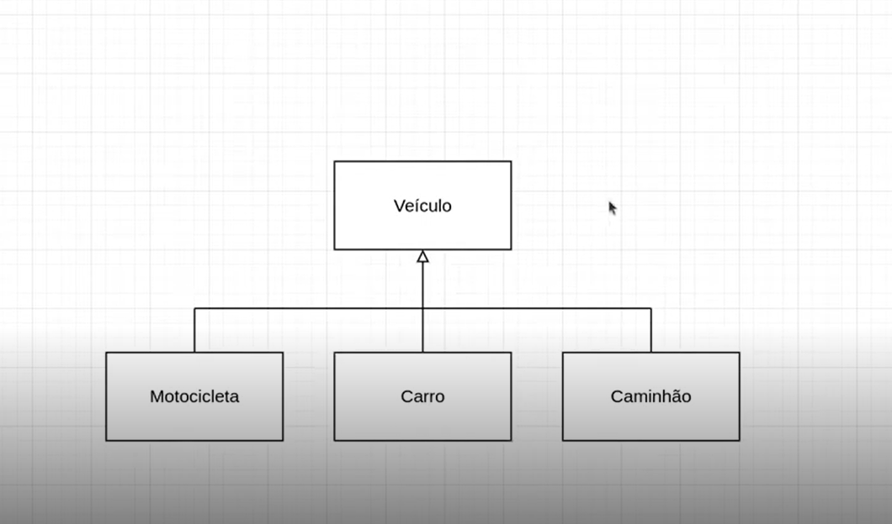
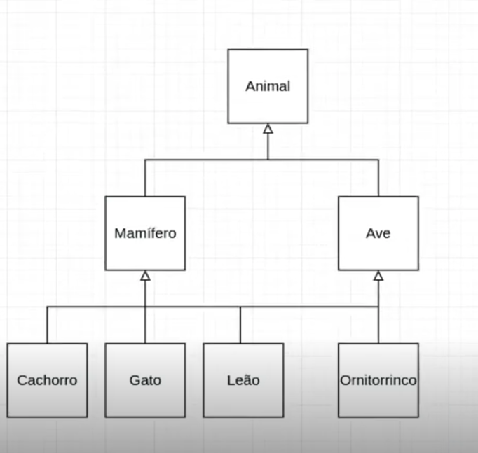

# 2 .Aprendendo o Conceito de Herança com Python
## Sumário 
- [Heranaça POO](#1-herança-poo)  
  - [Objetivo](#objetivo-geral)
- [Conceito de Heranças](#2-conceituando-herança-simples-e-herança-múltipla)
- [Diagrama e código herança simples](#3-hands-on-herança-simples)
- [Diagrama e código herança múltipla](#4-hands-on-herança-múltipla)
- [Links](#links-uteis)
---
## 1. Herança POO
### Objetivo Geral 
Aprender o que é herança em POO e como podemos utilizá-la em Python. 
### Herança em Poo
__O que é herança?__  
Em programação herança é a capacidade de uma classe filha derivar ou herdar as características e comportamentos da classe pai (base).  
__Benefícios da herança__  
- Representa bem os relacionamentos do mundo real. 
- Fornece reutilização de código, não precisamos escrever o mesmo código repetidamente. Além disso, permite adicionar mais recursos a uma classe sem modificá-la. 
- É de natureza transitiva, o que significa que, se a classe B herdar da classe A, todas as subclasses de B herdarão automaticamente da classe A.  
__Sintaxe da Herança__  
```
class A:
  pass
class B(A):
  pass
```
---
## 2. Conceituando Herança Simples e Herança Múltipla 
__Herança simples__  
Quando uma classe filha herda apenas uma classe pai, ela é chamada de herança simples. 
```
class A:
  pass
class B(A):
  pass
```
__Herança múltipla__  
Quando uma classe filha herda de várias classes pai, ela é chamada de herança múltipla. 
```
class A:
  pass
class B:
  pass

class c(A,B):
  pass 

```
--- 
## 3. Hands-on: Herança Simples
Modelo de herança simples  
  
O código propriamente dito da aula está [aqui](/src/01_heranca_simples.py)

--- 
## 4. Hands-on: Herança Múltipla 
Modelo de herança múltipla  
  
O código propriamente dito da aula está [aqui](/src/02_heranca_multipla.py)


--- 
### Links Uteis
- [Trilha no git](https://github.com/digitalinnovationone/trilha-python-dio)

---
As respostas da aula 2 estão [aqui](IMGS)

---
<table style="text-align: center; width: 100%;"> 
<caption><b> Skils do projeto </b></caption>
<tr>
    <td style="text-align: center;">
    
    </td>
    <td style="text-align: center;">
    
    </td>
    <td style="text-align: center;">
    
    </td>
<tr> 
</table>

---
Titulo: 2 .Aprendendo o Conceito de Herança com Python 

Autor: Thierry Lucas Chaves

Data criacao: 01/07/2025

Data modificacao: 05/07/2025

Versao: 1.0  

---