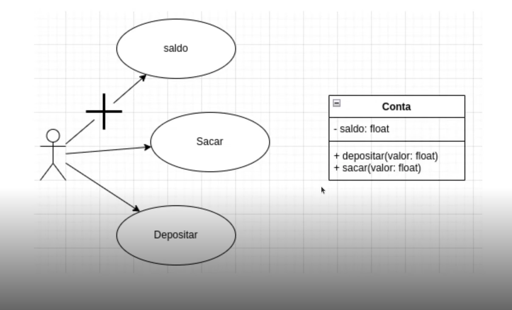

# 3 .Aplicando Encapsulamento em Python
## Sumário 
- [O que é Encapsulamento](#1-o-que-é-encapsulamento)
- [Recursos publico e privados](#2-recursos-público-e-privados)
- [Propriedades](#3-propriedades)
- [links](#links-uteis)
---
## 1. O que é Encapsulamento?
### Objetivo Geral 
Entender o conceito de encapsulamento e como podemos aplicá-lo utilizando Python.
__Conceitos__  
O encapsulamento é um dos conceitos fundamentais em programação orientada a objetos. Ele descreve a ideia de agrupar dados e os métodos que manipulam esses dados em uma unidade. Isso impõe restrições ao acesso direto a variáveis e métodos e pode evitar a modificação acidental de dados. Para evitar alterações acidentais, a variável de um objeto só pode ser alterada pelo método desse objeto.  
  

---
## 2. Recursos público e privados
__Modificadores de acesso__  
Em linguagens como Java e C++, existem palavras reservadas para definir o nível de acesso aos atributos e métodos da classe. Em python não temos palavras reservadas, porém usamos convenções no nome do recurso, para definir se a variável é pública ou privada. 
*PS:Em python quando queremos que uma variável seja de utilização privada, utilizamos por convenção o caractere "_"(underline), e quando não apenas mantemos o nome dele*.  
__Definição__  
- __Público:__ Pode ser acessado de fora da classe. 
- __Privado:__ Só pode ser acessado pela classe. 

__Público/Privado__  
Todos os recursos são públicos, a menos que o nome inicie com underline. Ou seja, o interpretador Python não irá garantir a proteção do recurso, mas pode ser uma convenção amplamente adotada na comunidade, quando encontramos uma variável e/ou método com nome iniciado por underline, sabemos que não deveríamos manipular o seu valor diretamente, ou invocar o método fora do escopo da classe.   
__Exemplo__  
```
class Conta:
  def __init__(self, saldo=0):
      self._saldo = saldo
  
  def depositar(self,valor):
      pass

  def sacar(self,valor):
      pass
```
mais detalhes em: [Código](src/01_encapsulamento.py)  

--- 
## 3. Propriedades 
__Para que servem?__  
Com o property() em Python, você pode criar atributos gerenciados em suas classe. Você pode usar atributos gerenciados, também conhecidos como propriedades, quando modificar sua implementação interna sem alterar a API pública da classe.  
__Exemplo:__  
```
class Foo:
    def __init__(self,x=None):
        self._x = x
    
    @property
    def x(self):
        return self._X or 0

    @x.setter
    def x(self,value):
        _x = self._x or 0
        _value = value or 0
        self._x = _x + _value
    
    @x.deleter
    def x(self):
        self._x = -1

foo = Foo(10)
print(foo.x)
foo.x = 10
print(foo.x)
del foo.x
print(foo.x)

```
o @property basicamente pega um método em python e o transforma em propriedade, por isso é comumente chamado de valor computado, pois ele pode ter uma ação para montar o valor da sua variável. Em sintaxe, ao se usar o @property você infere algum tipo de computação a uma variável, seja atribuir uma soma retornar algum valor dependendo de alguma ação etc... para além de faze com que um método seja utilizado com uma sintaxe de atributo. Outra coisa que se ganha ao utilizar @property e que como ele é declarado como uma variável você não conseguira atribuir valores diretamente a aquela variável, ele se torna de certa forma **READ ONLY**, isso caso não haja @setter definido. 
mais detalhes em: [Código exemplo foo](src/02_propriedades_exemplo_foo.py)  & [Código exemplo Pessoa](src/03_propriedade_pessoa.py)

--- 

### Links Uteis
- [Trilha no git](https://github.com/digitalinnovationone/trilha-python-dio)

---

As respostas da aula 3 estão [aqui](IMGS)

---
<table style="text-align: center; width: 100%;"> 
<caption><b> Skils do projeto </b></caption>
<tr>
    <td style="text-align: center;">
    
    </td>
    <td style="text-align: center;">
    
    </td>
    <td style="text-align: center;">
    
    </td>
<tr> 
</table>

---
Titulo: 3 .Aplicando Encapsulamento em Python 

Autor: Thierry Lucas Chaves

Data criacao: 01/07/2025

Data modificacao: 05/07/2025

Versao: 1.0  

---