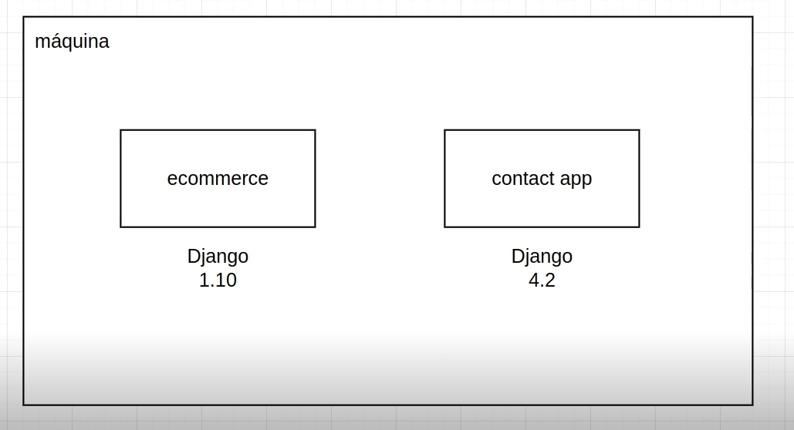

# 4 .Gerenciamento de Pacotes, Convenções e Boas Práticas Python
## Sumário 
- [O que são pacotes e uso do pip](#1-o-que-são-pacotes-e-uso-do-pip)
  - [Objetivo Geral](#11-objetivo-geral)
  - [O que são pacotes Python](#12-o-que-são-pacotes-em-python)
  - [O papel do pip e exemplos de comandos](#13-o-papel-do-pip)
  - [Uso de ambiente virtuais](#14-uso-de-ambientes-virtuais)
  - [Comando básicos do pip](#15-comando-do-pip)
    - [Exemplos de comandos pip](#151-exemplos-de-comandos-pip)
- [Gerenciando dependências do Pipenv](#2-gerenciando-dependências-do-pipenv)
  - [Introdução ao pipenv](#21-introdução-ao-pipenv)
  - [Comandos do pipenv](#22-comandos-do-pipenv)
- [Gerenciando dependências do Poetry](#3-gerenciando-dependências-do-poetry)
  - [Introdução do poetry](#31-introdução-ao-poetry)
  - [Comandos do poetry](#32-comandos-do-poetry)
- [Boas práticas](#4-boas-práticas)
  - [Introdução sobre boas práticas com ambientes virtuais](#41-introdução)
  - [O que é o PEP 8](#42-o-que-é-pep-8)
  - [Principais recomendações da PEP 8](#43-principais-recomendações-da-pep-8)
    - [Uso de ferramentas de checagem de estilo](#431-uso-de-ferramentas-de-checagem-de-estilo)
    - [Formatação automática de código](#432-formatação-automática-de-código)
    - [Organização de imports com isort](#433-organização-de-imports-com-isort)
- [Desafio](#5-explicação-desafio)
- [links úteis](#links-uteis)
---
## 1. O que são pacotes e uso do pip
### 1.1 Objetivo Geral 
Aprender a trabalhar com gerenciamento de pacotes em Python, e boas práticas de codificação seguindo as convenções da PEP 8.
### 1.2 O que são pacotes em Python?
Pacotes são módulos que podem ser instalados e utilizados em seus programas Python. Eles permitem que você utilize código que foi escrito por outras pessoas, economizando tempo e esforço.  
### 1.3 O papel do pip 
Pip é o gerenciador de pacotes do Python. Ele nos permite instalar, atualizar e remover pacotes facilmente. Ele se comunica com PyPi `(Python Package Index)`, que é onde a maioria dos pacotes Python são armazenados.  
__Exemplo de código:__  
```
pip install numpy
pip uninstall numpy
pip list
```
### 1.4 Uso de ambientes virtuais
Ambientes virtuais, como os criados por venvs, nos permitem manter as dependências de diferentes projetos. Isso é importante para evitar conflitos entre versões de pacotes. 
  
No diagrama acima exemplifica uma situação de 2 projetos paralelos, que dependem de bibliotecas exclusivas, no cenário ilustrado, ambos utilizam a mesma biblioteca Django, porém em versões diferentes, com isso posto a cada nova interação com um desses projetos seria necessário instalar e desinstalar os pacotes toda vez que for utilizar/mexer em um dos programas. Para que isso não seja um problema (repetição de processo de `pip install & pip uninstall`), localmente, utilizamos o ambiente virtual em Python.  
```
python3 -m venv myenv
source myenv/bin/activate

```
### 1.5 Comando do pip
Como um programador que está aprendendo Python e deseja gerenciar os pacotes do seu projeto, e importante conhecer alguns dos principais comandos pip.  
#### 1.5.1 Exemplos de comandos pip
```
# Instalar um pacote
pip install nome_do_pacote

# Desinstalar um pacote
pip uninstall nome_do_pacote

# Listar pacotes instalados
pip list 

# Atualizar um pacote
pip install --upgrade nome_do_pacote

```
---
## 2. Gerenciando dependências do Pipenv
### 2.1 Introdução ao pipenv
Pipenv é uma ferramenta de gerenciamento de pacotes que combina a gestão de dependências com a criação de ambiente virtual para seus projetos e adiciona/remove pacotes automaticamente do arquivo Pipfile conforme você instala e desinstala pacotes. 
### 2.2 Comandos do pipenv 
```
pip install pip env 
pipenv install numpy
pipenv unistall numpy 
pipenv lock
pipenv graph

```

Um ponto a se atentar e que a instalação do pip env recomendasse que seja global, pois como essa ferramenta será a responsável por gerenciar todos os pacotes do projeto existentes em sua máquina, recomenda-se que sua instalação seja global. 
Outro ponto e sobre o comando `pipenv lock`, esse comando meio que garante que ao final do processo de instalação ele irá ler o arquivo Pipfile, gera um arquivo de *"fechamento"* para que quando se utilizado o `pipenv install` ele instale exatamente as mesma dependências que foram utilizadas no momento que foi feita a primeira instalação dos pacotes.  
Em sintaxe o `pipenv lock` serve para garantir que os pacotes que foram instalados para execução primária/final do projeto, sejam as mesmas em suas versões de pacotes e  codependência.
Sobre o comando `pipenv graph` esse comando diferentemente do `pip list` também irá mostrar quais são os pacotes instalados, porém ao executar tal comando **ele irá demonstrar também quais são as dependências aninhadas** de uma maneira mais clara. ex:  
```
pipenv graph
django==5.2.4
├── asgiref [required: >=3.8.1, installed: 3.9.1]
└── sqlparse [required: >=0.3.1, installed: 0.5.3]

```
Ainda sobre os comando úteis do pipenv vale ressaltar o comando `pipenv clean`, esse comando irá realizar a limpeza de dependências aninhadas/pacotes que estão sem especificações default do `Pipfile.lock`, tal qual é feito com o comando `sudo apt autoremove` que remove os pacotes não utilizados no LINUX.

---
## 3. Gerenciando dependências do Poetry
### 3.1 Introdução ao poetry
O poetry é outra ferramenta de gerenciamento de dependências para Python que permite declarar as bibliotecas de que seu projeto depende e gerencia *(instala/atualiza/remove)* essa bibliotecas para você. Ela também suporta o empacotamento e a publicação de projetos PyPi.  
### 3.2 Comandos do poetry
__Exemplo de comandos__  
```
pip install poetry
poetry new myproject
cd myproject 
poetry add numpy
poetry remove numpy

```
Tal qual é feito no [pipenv](#22-comandos-do-pipenv) o poetry também deverá ser instalado globalmente, uma ves que essa ferramenta também é utilizada para gerenciamento dos pacotes a serem utilizados em um projeto. Outro ponto de diferença entre o pipenv, e que o arquivo de inicialização será o `pyproject.toml`

diferentemente do pipenv o poetry, para que seja instalado os pacotes que foram definidos na criação do ambiente, (isto posto que fora definido pacotes), no ato da criação do ambiente virtual, deve-se utilizar o comando `poetry install` com esse comando todos os pacotes que foram definidos no arquivo `pyproject.toml` serão instalados, em linhas gerais o que difere são os comandos, porém o objetivo é o mesmo. 
Outro comando que pode ser utilizado no poetry é  comando `poetry show` ao executar tal comando é demonstrado as informações sobre os pacotes, para que a saída de dependências seja similar ao `pipenv grapah` basta passar como argumento -t:  
```
oetry show -t 
django==5.2.4 A higth-level Python web frawork thah encourages rapid development and clean, pragmatic design.
├── asgiref >=3.8.1 <4 
└── sqlparse >=0.3.1
└── tzdata *
```
Outro ponto de destaque do poetry, e que ao ser removido um pacote com `poetry remove` o poetry já realiza a remoção dos pacotes de dependência aninhadas. 

---
## 4. Boas práticas
### 4.1 Introdução
Python tem uma série de convenções e melhores práticas codificadas em PEPs (Propostas de Melhoria do Python). A mais conhecida destas é provavelmente a PEP 8, que cobre o estilho de codificação.  
### 4.2 O que é PEP 8?
[PEP 8](https://peps.python.org/pep-0008/) é o guia de estilo de codificação em Python. Ele inclui convenções sobre nomes de variáveis, uso de espaços em branco, comprimento de linha e muitas outras coisas que ajudam a manter o código Python consistente e legível. 
### 4.3 Principais recomendações da PEP 8
Algumas da principais recomendações da PEP 8 incluem usar:
 - 4 espaços para identação.
 - Limitar as linhas a 79 caracteres.
 - Usar nomes de variáveis em snake_case para funções e variáveis.
 - Usar CamelCase para classes.  
__Exemplo de código:__ 
```
def somar(argumento_1, argumento_2):
    # Esta é uma função de exemplo seguindo a PEP 8 
    pass 


class ContaBancaria:
    # Esta é uma classe de exemplo seguindo a PEP 8 
    pass
```
### 4.3.1 Uso de ferramentas de checagem de estilo
Para nos ajudar a seguir as recomendações da  PEP 8, podemos usar ferramentas de checagem de estilo como flake8.  
Essas ferramentas verificam nosso código e nos informam onde estamos desviando do guia de estilo. 
__Exemplo de código:__ 
```
pip install flake8
flake8 meu_script.py
```
### 4.3.2 Formatação automática de código
Black é uma ferramenta de formatação Python que segue a filosofia "formato único". Black reformata todo o seu arquivo em um estilo consistente, simplificando a tarefa de manter o código em conformidade com a PEP 8. 
__Exemplo de código:__ 
```
pip install black 
black meu_script.py

```
### 4.3.3 Organização de imports com isort
Isort é uma ferramenta Python para classificar importações alfabeticamente e separá-las automaticamente em seções. Ele proporciona uma maneira rápida e fácil de ordenar e categorizar suas importações.  
__Exemplo de código:__ 
```
pip install isort
isort meu_script.py
```  
---
## 5 Explicação Desafio 
Neste desafio deverá ser utilizado os comandos de para adequação dos códigos usando linters e formatadores flake8, balck e isort respectivamente, para formatar o código em questão, e auxiliar que o código não contenha `erros` de não conformidade com a PEP 8

__`Hint: `__ ao se utilizar o black pode ser utilizado como argumento `-l` esse argumento irá determinar o tamanho da linha a ser utilizada.

o resultado pode ser encontrado [aqui](https://github.com/thierryLchaves/Desafios-Python-DIO/tree/pacotes_e_boas_praticas/Gerenciamento%20de%20pacotes%20convencoes%20e%20boas%20praticas) 

--- 

### Links Uteis
- [Repositório DIO](https://github.com/digitalinnovationone/trilha-python-dio)
- [PyPi](https://pypi.org)
- [Pipenv](https://pipenv.pypa.io)
- [Poetry](https://python-poetry.org/docs)

<!-- ---
As respostas da aula 4 estão [aqui](IMGS)

tabela exemplo 
| | |
| -- | -- |
| nome | valor |

<div style="border-left: 4px solid red; background-color:rgb(22, 23, 24); padding: 10px;">
  <strong style="color: red;">Exemplo de alerta</strong>
  <p> Somente um exemplo.</p>
</div>

exemplo código 
```
print("Hello World!")
```
--- -->
<table style="text-align: center; width: 100%;"> 
<caption><b>Skils do projeto </b></caption>
<tr>
    <td style="text-align: center;">
    
    </td>
    <td style="text-align: center;">
    
    </td>
    <td style="text-align: center;">
    
    </td>
<tr> 
</table>

---
Titulo: 4 .Gerenciamento de Pacotes, Convenções e Boas Práticas Python 

Autor: Thierry Lucas Chaves

Data criacao: 08/07/2025

Data modificacao: 18/07/2025

Versao: 1.0  

---