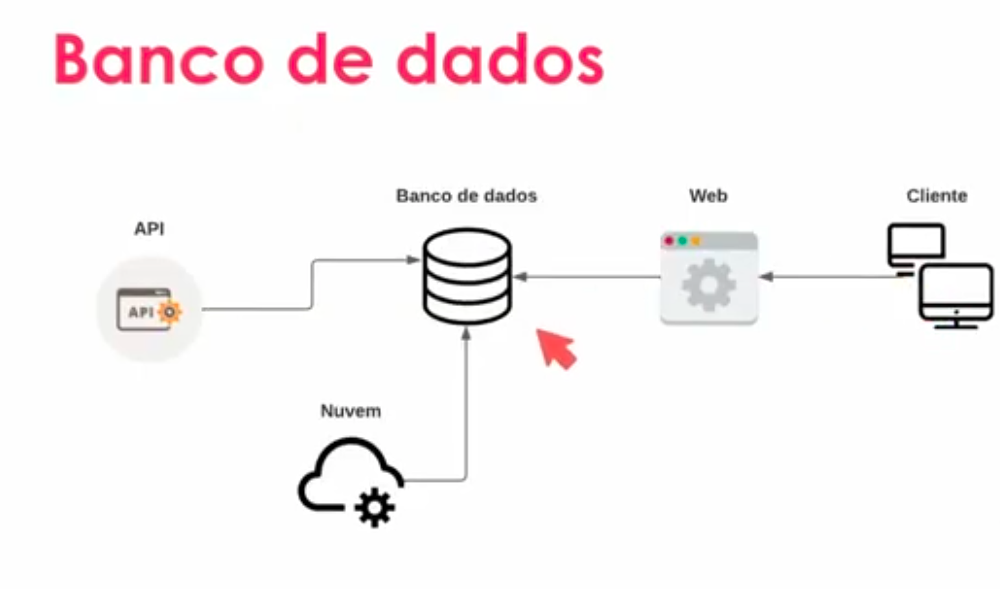
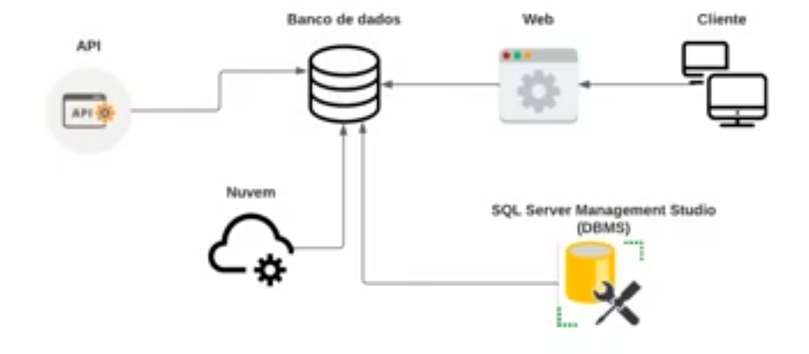

# 1 .Introducao Banco de Dados
## Sumário 
- [Introdução do módulo](#1-introdução-do-módulo)
- [Definição de Banco de Dados](#2-introdução-à-banco-de-dados)
- [TIpos de banco de dados](#3-tipo-de-banco-de-dados)
  - [Banco de dados Relacional ](#31-banco-de-dados-relacional)
    - [O que é uma tabela](#311-entendendo-uma-tabela-entendendo-uma-tabela)
  - [Banco de dados Não Relacional ](#32-banco-de-dados-não-relacional)
    - [Tipos de dados Não relacionais](#321-tipos-de-dados-tipos-de-dados)
- [Entendendo o DBMS](#4-entendendo-o-dbms)
---
## 1. Introdução do módulo 
### Objetivo Geral 
Aprender os principais conceitos de banco de dados, SQL, comandos, tratamento e junção de dados, __com foco em desenvolvimento__  

---
## 2. Introdução à Banco de dados 
### 2.2 Banco de dados 
Um banco de dados é um coleção organizada de informações (ou dados) estruturadas, normalmente armazenadas eletronicamente em um sistema de computador. [fonte](https://www.oracle.com/br/database/what-is-database).  
Então na prática um banco de dados segue uma premissa padrão no ponto de vista de funcionalidade(acessar, atualizar, deletar e inserir) as informações, dado isso faz-se a necessidade de um sistema ter um banco de dados, que é um software que irá armazenar esse dado de forma __estruturada__ que nada mais é um dado onde se possa acessar esse dado e utiliza-lo posteriormente de forma inteligível.  
.  

---
## 3. Tipo de Banco de dados 
### 3.1 Banco de dados relacional:
O tipo mais usado atualmente, armazenando dados estruturados, sendo organizado em tabelas, com colunas e linhas, que se relacionam entre si. 
Exemplos : 
  
[fonte](https://www.oracle.com/br/database/what-is-database).
Ou seja a utilização desse tipo de banco de dados, se da quando é possível realizar a separação e classificação dos dados. Tal qual uma matriz de um arquivo como Excel, porém nesse modelo um banco de dados trabalha com a classificação dessas informações, pois cada dado ali armazenado tem o seu tipo e tamanho e seu __relacionamento__ 

---
#### 3.1.1 Entendendo uma tabela 
#####  Entendendo alguns conceitos !

__Tabelas:__ São dados estruturados e organizados logicamente em formato de linha e coluna.

Clientes
| | | | | | |
| -- | -- | -- | -- | -- | -- |
| ID | Nome | Sobrenome | Email| AceitaComunicados | DataCadastro |
| 1 | Leandro | Buta | Email@gmai.com | 1 | 29/04/2022 |
| 2 | Peter | Anderson | Email@gmai.com | 0 | 29/04/2022 |
| 3 | Taylor | Adams | Email@gmai.com | 1 | 29/04/2022 |


Enderecos
| | | | | | |
| -- | -- | -- | -- | -- | -- |
| ID | Rua | Bairro | Cidade | Estado | IdCliente |
| 1 | Rua 1 | Bairro 1 | Cidade 1 | Estado 1 | 1 |

Outro ponto valido de se ressaltar, e de que quando falamos de banco de dados relacional, mais propriamente falando do caso de __dados estruturados__ no ato da criação ou de uma tabela em um banco de dados, a mesma deverá obedecer uma uniformização de dados para cada coluna. exemplo o campo de DataCadastro deverá receber apenas informações do tipo de data assim como os demais campos. Por isso o banco de dados relacional tem como premissa um dado estruturado pois a inserção desses dados deverá ter um tipo de inserção "rígida" para sempre ficar com seus dados ali armazenados de uma forma mais organizada. 

--- 
### 3.2 Banco de dados não relacional 
Banco de dados não relacional: Banco de dados onde os dados não são armazenados em tabela, e sim armazenados de maneira não estruturadas ou semi-estruturadas. 
   
Existem vário tipos: document databases, key-values databases, wide-column stores, e graph databases.[Fonte](https://www.mongodb.com/nosql-explained)  
Em antítese a um SGBD relacional, quando trabalhamos com um banco de dados não relacional onde se tem uma tabela que pode se relacionar ou não com outra tabela para obtenção de um dado/informação assim como também a "rigidez" na inserção dos tipos de dados ali contidos conforme descrito anteriormente [ultimo parágrafo](#311-entendendo-uma-tabela), ou seja no modelo relacional somente será aceito um tipo de dado para uma determinada coluna, já no banco de não relacional temos uma maior flexibilidade, quando se trata por exemplo de um banco de dados __semi-estruturado__, nesse quesito a parte da estrutura aplica-se a quantidade de colunas de uma tabela entretanto o valor ali contido pode variar. Já no que diz respeito a um dado __não estruturado__ seria um dado em sua maneira "bruta", exemplo um arquivo de texto, uma imagem pdf mp3, são dados que existem porém não seguem um padrão se assim podemos dizer para realizar uma analise, pois a grande diferença dos modelos de dados aqui descritos se da que esses dados não seguem uma estrutura de formato ou padrão.

--- 
### 3.2.1 Tipos de dados
#### Tipo de dados estruturado 
Clientes
| | | | | | |
| -- | -- | -- | -- | -- | -- |
| ID | Nome | Sobrenome | Email| AceitaComunicados | DataCadastro |
| 1 | Leandro | Buta | Email@gmai.com | 1 | 29/04/2022 |
| 2 | Peter | Anderson | Email@gmai.com | 0 | 29/04/2022 |
| 3 | Taylor | Adams | Email@gmai.com | 1 | 29/04/2022 |


Enderecos
| | | | | | |
| -- | -- | -- | -- | -- | -- |
| ID | Rua | Bairro | Cidade | Estado | IdCliente |
| 1 | Rua 1 | Bairro 1 | Cidade 1 | Estado 1 | 1 |

#### Tipo de dados semi-estruturado 
```
[
  {
    "id", 1, 
    "Nome_Produto": "Material de escritório", 
    "Preco": "25.00", 
    "DataVenda": "2022-04-23T01:23:26.9666539-03:00",
    "Desconto":null
  }, 
  {
    "id", 2, 
    "Nome_Produto": "Licença de Software", 
    "Preco": 110.00, 
    "DataVenda": "2022-04-23T01:23:26.9666539-03:00",
    "Desconto":10,
    "Cupom": "1234"
  }
]
```
No modelo de dados estruturado seria o tipo de dados que um modelo de banco de dados relacional utiliza com modelo de linha e coluna, outro ponto é que nesse modelo em questão caso se deseje retirar uma coluna ela será aplicada por inteiro não será apenas para um caso especifico, assim como o tipo de dados que é inserido/definido para aquela coluna. Em sintaxe nesse modelo se tem um padrão e aquele padrão deverá ser obedecido. 
Já no modelo semi-estruturado nesse modelo em si ele ainda tem um padrão conforme o [exemplo](#tipo-de-dados-semi-estruturado), pode-se observar que os dados ali ainda tem uma especie de padrão, que pode ser encarado como chave valor, porém nesse modelo de dados não se faz a generalização, ou seja esse padrão seguido para inserção dos dados do **ID 1**, não deverá ser 100% seguido para o **ID 2**,  como visto existem diferenças entre cada registro onde em Um temos uma coluna a mais como cupom, essa diferença pode vir de maneira do tipo de dado visto no campo de preco onde no **ID 1** é do tipo varchar já no **ID 2** é do tipo inteiro ou float , ou seja a generalização tanto do tipo de dado da coluna quanto na quantidade de colunas para cada registro e devidamente seguinte em generalização. 

--- 
## 4. Entendendo o DBMS
### DBMS
__Database Management System:__ É um software utilizado para acessar, manipular e monitora rum sistema de banco de dados. 
  


--- 
### Links Uteis
- [Mongo db](https://www.mongodb.com/nosql-explained)  
- [O que um Banco de dados](https://www.oracle.com/br/database/what-is-database)

---
As respostas da aula 1 estão [aqui](imgs/Prova/)

---
<table style="text-align: center; width: 100%;"> 
<caption><b>Skils do projeto </b></caption>
<tr>
    <td style="text-align: center;">
    
    </td>
    <td style="text-align: center;">
    
    </td>
<tr> 
</table>

---
Titulo: 1 .Introducao Banco de Dados 

Autor: Thierry Lucas Chaves

Data criacao: 21/07/2025

Data modificacao: 21/07/2025

Versao: 1.0  

---