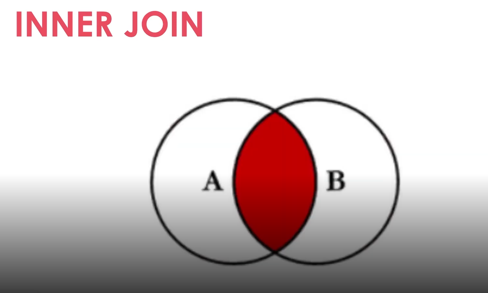

# 2 .Introdução Banco de Dados Relacional (SQL)
## Sumário 
- [Introdução ao módulo](#1-introdução-aos-bancos-de-dados-relacionais)
  - [Apresentação do Curso](#11-apresentação-do-curso)
  - [Conceitos básicos de um Banco Relacional](#12-conceitos-básicos-e-estrutura-do-banco-de-dados-relacional)
  - [Conceitos básicos de sql](#13-introdução-e-conceitos-básicos-de-sql)
  - [MERxDER](#14-mer-e-der-modelagem-de-banco-de-dados)
  - [Configurando o ambiente](#15-configuração-do-ambiente)
- [Modelagem de dados](#2-modelagem-de-dados-relacionais)
  - [Tabelas, Colunas e Registros](#21-tabelas-colunas-e-registros)
      - [Tebelas](#211-tabelas)
      - [Colunas](#212-colunas)
      - [Registros](#213-registros)
      - [Create table](#214-comando-create-table)
        - [Opções de create table](#2141-comando-create-table---opções)
      - [Tipos de dados](#215-tipos-de-dados)
  - [Insert Select](#22-operações-crud-insert-e-select)
     - [INSERT](#221-comando-insert)
     - [SELECT](#222-comando-select)
     - [SELECT WHERE](#223-comando-select-com-where)
     - [SELECT com Operadores](#224-comando-select---operadores)
  - [Update Delete](#23-operações-crud-update-e-delete)
     - [UPDATE](#231-comando-update)
     - [DELETE](#232-comando-delete)
  - [Alteração e Exclusão de Tabelas](#24-alterando-e-excluindo-tabelas)
     - [DROP TABLE](#241-drop-table)
     - [ALTER TABLE](#242-alter-table)
  - [PK & FK](#25-chaves-primárias-e-estrangeiras)
     - [Primary Key](#251-chaves-primária)
     - [Foreign Key](#252-chaves-estrangeiras)
     - [Restrições FK](#253-chaves-estrangeiras---restrições)
- [Normalização de dados](#3-normalização-de-dados)
    - [O que é Normalização de dados](#31-o-que-é-a-normalização-de-dados)
      - [FN: Formas Normais](#311-formas-normais)
      - [Resumo das FNS](#312-resumo)
- [Consultas Avançadas](#4-consultas-avançadas)
  - [Consultas com junções e SUb-consultas](#41-consultas-com-junções-e-sub-consultas)
      - [JOIN](#411-junções-joins)
      - [Tipos de junçõe](#412-junções-tipos)
        - [INNER](#4121-inner-join)
        - [LEFT](#4122-left-join)
        - [RIGHT](#4123-right-join)
        - [FULL](#4124-full-join)
      - [SUB Query](#413-sub-consultas)
  - [Funções de agrupamento](#42-funções-agregadas-e-agrupamento-de-resultados)
    - [Funções agregadas](#421-funções-agregadas)
    - [Grop by](#422-agrupamento-de-resultados)
    - [Order by](#423-ordenação-de-resultados)
  - [Indices nas consultas](#43-indices)
    - [Plano de Execução](#431-análise-do-plano-de-execução)
    - [Index](#432-índices-de-busca)
- [Links e Refs](#links-uteis)
---
## 1. Introdução aos Bancos de dados Relacionais
### 1.1 Apresentação do curso
#### Objetivo Geral 
O objetivo geral do curso é fornecer uma introdução aos Banco de Dados Relacionais e desenvolver habilidades na criação, modelagem e consulta desses bancos. 
### 1.2 Conceitos Básicos e Estrutura do banco de dados Relacional
O banco de dados é uma coleção estruturada de informações ou dados,podendo ser ou não armazenada de forma eletrônica dentro de um computador. 
#### Tipos de Banco de dados. 
- Relacionais/SQL 
- Não relacionais/NoSQL (Not OnlySQL)
- Orientado a Objetos
- Hierárquico 
  
__Funcionalidades básicas:__ 
- **C**reate
- **R**ead
- **U**pdate
- **D**elete
  
__Características__  
- Relacionamento entre tabelas 
  - > Ou seja as informações são relacionadas entre sí, para que elas possam compor uma informação mais relevante para o contexto do sistema. 
- Linguagem de consulta estruturada (SQL)
- Integridade referencial 
  - > Este tópico está diretamente atrelado ao relacionamento entre as tabelas, ou seja quando há informações dependente de outras tabelas, o sistema irá notificar que não será possível implementar uma informação sem que haja essa referência interdependente, o que irá garantir a integridade das informações, fazendo assim com que não haja *"dados órfãos"* por assim dizer. 
- Normalização de dados
  - > Ou seja a forma na qual é estruturado de forma normativa e única para o sistema.
- Segurança 
  - > A garantia de que as informações somente possam ser acessadas por quem de fato deve acessar essa informação. 
- Flexibilidade e extensibilidade 
  - > Refere-se a questão de poder alterar o Schemas de dados, pois o banco de dados oferece a possibilidade de alterações na estrutura de tabelas já criadas. 
- Suporte a transações ACID
  - Que seria a garantia das informações dentro de um banco de dados, que seria um acrônimo para:
    1. **A**tomicidade  
        - > Garante que todas as operações de um transação sejam executadas, em caso de falha nenhuma é
    2. **C**onsistência  
        - >Atrelada diretamente com o conceito de atomicidade, o conceito aqui empregado visa garantir que o banco saia de um estado consistente para outro estado igualmente consistente
    3. **I**solamento 
        - > Garante que cada transação seja feita de forma isolada, sem interferência direta de outra transação concorrente
    4. **D**urabilidade 
        - > Garante que uma vez que uma transação seja confirmada aquela informação seja permanente, ou seja garante que uma vez que a informação seja *'comitada'* aquela informação não irá retornar ao estado anterior.
### 1.3 Introdução e Conceitos básicos de SQL
O SQL é uma linguagem de consulta padronizada, que é amplamente utilizada/adotada para interação junto a um banco de dados. É através do SQL que podemos realizar consultas, atualizações, inserções e até mesmo deleções de dados dentro do banco de dados e seus Schemas.  
#### Organização da SQL
   1. __DQL -__ Linguagem de Consulta de Dados.
      - > SELECT;
        - Também disponível exemplos em [aqui](db/DQL_Viagens_01.sql)
   2. __DML -__ Linguagem de Manipulação de Dados.
      - > INSERT, UPDATE e DELETE;
        - Também disponível exemplos em [aqui](db/DML_Viagens_01_(INSERT).sql) e [aqui](db/DML_Viagens_02_(UPDATE,%20DELETE).sql)
   3. __DDL -__ Linguagem de Definição de Dados.
      - > CREATE, ALTER, DROP;
        - Também disponível exemplos em [aqui](db/DDL_Viagens_01_(CREATE).sql), [aqui](db/DDL_Viagens_02_(DROP,%20ALTER).sql) e [aqui](db/DDL_Viagens_03_(PK_KF).sql)
   4. __DCL -__ Linguagem de Controle de Dados.
      - > GRANT, REVOKE;
   5. __DTL -__ Linguagem de Transação de Dados.
      - > BEGIN, ,COMMIT, ROLLBACK;
#### Sintaxe Básica:  Nomenclatura
- Os nomes devem começar com uma letra ou com um caractere de sublinhado (_)
- `***` Os nomes podem conter letras, números e caracteres de sublinhado (_)
- Sensibilidade a maiúsculas e minúsculas. 
### 1.4 MER e DER: Modelagem de banco de dados
#### MER e DER
O modelo Entidade-Relacionamento (MER) é representado através de diagramas chamados Diagramas Entidade-Relacionamento (DER)
### Entidades 
As entidades são nomeadas com substantivos concretos ou abstratos que representem de forma clara sua função dentro do domínio. 
  
#### Atributos 
Os atributos são as caraterísticas ou propriedade das entidades. Eles descrevem informações específicas sobre uma entidade.  

#### Relacionamentos
Os relacionamentos representam as associações entre entidades. 

#### Cardinalidade
- Relacionamento 1..1(UM para UM)
- Relacionamento 1..n ou 1..* (UM para Muitos)
- Relacionamento n..n ou `*..*` (muitos para muitos)
  

### 1.5 Configuração do Ambiente
Para tal processo será utilizado o container do [mariaDB](https://github.com/thierryLchaves/Santander-2025---Back-End-com-Python/blob/64c437a486afadd435d40e851269687147b777e4/06-Integracao%20Python%20com%20Banco%20de%20dados/Docker-mysql), bem como as explicações de utilização também estarão presentes no documento [Readme](https://github.com/thierryLchaves/Santander-2025---Back-End-com-Python/blob/2b58ab87ae9a59f097b3e22fa33e4ce861068323/06-Integracao%20Python%20com%20Banco%20de%20dados/README.MD) do módulo 

---
## 2. Modelagem de dados Relacionais
### 2.1 Tabelas, Colunas e Registros
#### 2.1.1 Tabelas
Ela é usada para armazenar dados de forma organizada. Cada tabela em um banco de dados relacional tem um nome único e é dividida em colunas e linhas.  
#### 2.1.2 Colunas
Uma coluna é uma estrutura dentro de uma tabela que representa um atributo específico dos dados armazenados. Cada coluna tem um nome único e um tipo de dados associado que define o tipo de informação que pode ser armazenado nela, como números, textos, datas, etc..  
#### 2.1.3 Registros 
Um registro, também conhecido como linha ou tupla, é uma instância individual de dados em uma tabela.  
#### 2.1.4 Comando: CREATE TABLE
```sql
CREATE TABLE {{NOME}}
    ({{COLUNA}}{{TIPO}}{{OPÇÕES}}COMMENT 
{{COMENTARIO}});
```
#### 2.1.4.1 Comando: CREATE TABLE - OPÇÕES
- Restrições de valor:
   - > NOT NULL
   - > UNIQUE
   - > DEFAULT
- Chaves primárias e estrangeiras
- Auto Incremento

#### 2.1.5 Tipos de dados
Os dados podem variar muito entre os diversos SGBD's, porém os mais comuns são:  
- Inteiro(Integer)
- Decimal/Numérico (Decimal/Numeric)
- Caractere/Varchar (Character/Varchar)
- Data/Hora (Date/Time)
- Boleano(Boolean)
- Texto longo (Text)
### 2.2 Operações CRUD: Insert e Select
#### 2.2.1 Comando: Insert 
```sql
INSERT INTO 
{{NOME TABELA}}
([COLUNA1,COLUNA2,...] )--você pode ocultar as colunas 
values
([valor_coluna1, valor_coluna2,...])
```
#### 2.2.2 Comando: SELECT 
```SQL
SELECT {{lista_colunas}}
FROM tabela; 

-- Onde * retornas todas as colunas
```
#### 2.2.3 Comando: Select com Where
```sql
SELECT {{lista_colunas}}
FROM tabela
WHERE {{comando}};
```
#### 2.2.4 Comando: Select - Operadores
- '=' (igualdade)
- '<>' ou '!='(desigualdade)
- '>' (maior que)
- '<' (menor que)
- '>=' (maior ou igual que)
- '<=' (menor ou igual que)
- LIKE (comparação de padrões)
- IN (pertence a uma lista de valores)
- BETWEEN (dentro de um intervalo)
- AND (e lógico)
- OR (ou lógico)

### 2.3 Operações CRUD: Update e Delete
#### 2.3.1 Comando: Update
```sql
UPDATE {{TABELA}}
SET 
  {{coluna_1}} = {{novo_valor_1}},
  {{coluna_2}} = {{novo_valor_2}}
WHERE 
  {{CONDICAO}};
```
#### 2.3.2 Comando: Delete
```sql
DELETE FROM 
  {{TABELA}}
WHERE 
  {{CONDICAO}};
```
### 2.4 Alterando e excluindo tabelas
__Problema:__  
Usuários com endereços longos não estão conseguindo realizar o cadastro no sistema. 
Opções:
- Recriar a tabela, migrar os dados e exluir a tabela anterior. 
- Alterar a estrutura da tabela
#### 2.4.1 DROP TABLE 
O comando `DROP TABLE` é usado no SQL - para remover uma tablea existente de um banco de dados relacional.  
Ele exclui permanentemente a tabela 
```sql
DROP TABLE {{TABELA}}
```
#### 2.4.2 ALTER TABLE
A cláusula `ALTER TABLE` é usada no SQL para modificar a estrutura de uma tabela existente em um banco de dados relacional.  
Ela permite: 
  - Adicionar, alterar ou exluir colunas. 
  - Modificar as restrições, índices
  - Renomear a tabela entre outras alterações. 
```sql 
ALTER TABLE {{TABELA}} 
{{CONDICAO}};

```

### 2.5 Chaves Primárias e Estrangeiras
#### 2.5.1 Chaves Primária
- Identifica exclusivamente 
- Não pode conter valores nulos (NULL)
- Uma tabela pode ter apenas uma chave primária.
```sql
-- Utilização no ato de criar uma tabela 
CREATE TABLE {{TABELA}}
(id PRIMARY KEY AUTOINCREMENT,  --Constraint
....);
-- Utilização quando já se tem a tabela criada
ALTER TABLE {{TABELA}}
 MODIFY COLUMN id INT PRIMARY KEY;
```
#### 2.5.2 Chaves estrangeiras
Ela é usada para estabelecer e manter a integridade dos dados entre tabelas.
- Pode ser nula (NOT NULL); **registro órgão**
- É possível ter mais de uma (ou nenhuma) em uma tabela.
```sql
-- Utilização no ato de criar uma tabela 
CREATE TABLE {{TABELA}}(
  id INT PRIMARY KEY, 
  chave_estrangeira INT, 
  FOREIGN KEY (chave_estrangeira) REFERENCES {{outra tabela}}(id)
);
-- Utilização quando já se tem a tabela criada
ALTER TABLE {{TABELA}}
ADD CONSTRAINT {{nome_contraint}}
FOREIGN KEY (id_)
REFERENCES {{outra_tablea}}(id)
```
#### 2.5.3 Chaves Estrangeiras - Restrições
- >ON DELETE especifica o que acontece com os registros dependentes quando um registro pai é excluído. 
- >ON UPDATE define o comportamento dos registros dependentes quando um registro pai é autalizado. 
- >CASCADE, SET NULL, SET DEFAULT E RESTRICT
--- 
## 3. Normalização de dados
__Problema:__  
| | | |
| -- | -- | -- |
| id | nome | endereco |
| 1 | João | Rua A, 123, Cidade X, Estado Y |
| 2 | Maria | Rua b, 456, Cidade Y, Estado Z |
| 3 | Pedro | Avenida C, 789, Cidade X, Estado Y |

Como podemos buscar todos os usuários da Ciade X ?
### 3.1 O que é a normalização de dados
A normalização de dados é um processo no qual se organiza e estrutura um banco de dados relacional de forma a eliminar redundâncias e anomalias, garantindo a consistência e integridade dos dados.
#### 3.1.1 Formas Normais
- **1ª FN: Atomicidade de dados**  
  `A 1FN estabelece que cada valor em uma tabela deve ser atômico, ou seja, indivisível. Nenhum campo deve conter múltiplos valores ou listas. No caso, o campo "endereco" contém múltiplos valores, como rua, número, cidade e estado. Para atingir a 1FN, precisamos dividir o campo "endereco" em colunas separadas.`
  > 

- **2ª FN:**  
    - A 2FN estabelece que uma tabela deve estar na 1FN.
    - Todos os atributos não chave devem depender totalmente da chave primária  
`Dica se sua tabela tem uma **chave primária simples** não existe a possibilide de termos dependência parcial e portanto ela já se encontra na 2FN`

- **3ª FN:**  
    - Uma tabela deve estar na 2FN.
    - Nenhuma coluna não-chave depender de outra coluna não-chave.  
`Nosso exemplo: Relação Estado -> Cidade`
#### 3.1.2 Resumo 
- > A 1FN garante que cada valor seja atômico e que os registros sejam únicos e identificáveis. 
- > A 2FN garante que os atributos não chave dependam totalmente da chave primária, evitando dependência parciais. 
- > A 3FN elimina dependências transitivas entre os atributos não chave, garantindo que cada atributo não chave dependa apenas da chave primária, não avenda dependência indiretas entre eles. 
--- 
## 4. Consultas Avançadas
### 4.1 Consultas com junções e sub-consultas
#### 4.1.1 Junções: JOINs
São usadas no SQL para combinar dados de duas ou mais tabelas relacionadas em uma única consulta
#### 4.1.2 Junções: Tipos
- > INNER JOIN 
- > LEFT JOIN ou LEFT OUTER JOIN 
- > RIGHT JOIN ou RIGHT OUTER JOIN 
- > FULL JOIN ou FULL OUTER JOIN 
#### 4.1.2.1 INNER JOIN 
Retornas apenas as linhas que têm correspondência em ambas as tabelas envolvidas na junção. A junção é feita com base em uma condição de igualdade especificada na cláusula ON.
```sql
SELECT *
FROM TABELA1
INNER JOIN TABELA2 ON TABELA1.COLUNA = TABELA2.COLUNA;
```
> 

#### 4.1.2.2 LEFT JOIN 
Retorna todas as linhas da tabela à esquerda da junção e as linhas correspondentes da tabela à direita. Se não houver correspondência, os valores da tabela à direita serão `NULL`.
```sql
SELECT *
FROM TABELA1
LEFT JOIN TABELA2 ON TABELA1.COLUNA = TABELA2.COLUNA;
```
> 

#### 4.1.2.3 RIGHT JOIN 
Retorna todas as linhas da tabela à direita da junção e as linhas correspondentes da tabela à esqued. Se não houver correspondência, os valores da tabela à esquerda serão `NULL`.
```sql
SELECT *
FROM TABELA1
RIGHT JOIN TABELA2 ON TABELA1.COLUNA = TABELA2.COLUNA;
```
> 

#### 4.1.2.4 FULL JOIN 
Retorna todas as linhas de ambas as tabelas envolvidas na junção, combinando-as com base em uma condição de igualdade. Se não houver correspondência, os valores ausentes serão preenchidos com `NULL`. 
```sql
SELECT *
FROM TABELA1
FULL JOIN TABELA2 ON TABELA1.COLUNA = TABELA2.COLUNA;
```
> 
### 4.1.3 Sub Consultas
Elas permitem realizar consultas mais complexas permitindo que você uso o resultado de uma consulta como entrada para outra consulta. 
As subconsultas podem ser usadas em várias partes de um consulta: 
- > SELECT
- > FROM 
- > WHERE 
- > HAVING 
- > JOIN 

### 4.2 Funções agregadas e agrupamento de resultados
#### 4.2.1 Funções Agregadas
- > COUNT: Conta o número de registros. 
- > SUM: Soma os valores de uma coluna númerica.
- > AVG: Calcula a média dos valores de uma coluna numérica.
- > MIN: Retorna o valor mínimo de uma coluna. 
- > MAX: Retorna o valor máximo de uma coluna. 
#### 4.2.2 Agrupamento de Resultados
```sql
SELECT ...
FROM ...
GROUP BY 
```
#### 4.2.3 Ordenação de Resultados. 
- > Order by asc
- > order by desc
- > Order by colunas1, coluna2...
```sql
SELECT ...
FROM ...
ORDER BY 
```


### 4.3 Indices
#### 4.3.1 Análise do plano de Execução 
Ela nos permite examinar as operações realizadas, as tabelas acessadas, os índices utilizados e outras informações importantes para identificar possíveis melhorias de desempenho.
```sql
EXPLAIN 
SELECT *
FROM TABLE1
```
- > select_type: "SIMPLE", "SUBQUERY", "JOIN"
- > table. 
- > type: "ALL", "INDEX" entre outros. 
- > possible_keys: Os índices possíveis que podem ser utilizados nas operação. 
- > key: O índice utilizado na operação, se aplicável. 
- > key_len: O comprimento do índice utilizado. 
- > ref: As colunas ou constantes usadas para acessar o índice. 
- > rows
#### 4.3.2 Índices de Busca
Esses são fundamentais para melhorar o desempenho das consultas e otimizar a recuperação de informações em banco de dados. 
```sql
CREATE INDEX {{NOME_INDEX}}
ON {{TABELA}} ({{COLUNA1,COLUNA2...}})
```
--- 
### Links Uteis
- [O que é um Banco de Dados Relacional? (RDBMS)?](https://www.oracle.com/br/database/what-is-a-relational-database )
- [SQL Tutorial](https://www.sqltutorial.org)
- [Creately](https://app.creately.com)
- [Diagramas com IA](https://app.quickdatabasediagrams.com)
- [Banco de dados Nuvem](https://clients.cloudclusters.io)
- [Scripts](https://github.com/pamelaborges/dio-bd-relacional)
- [Formas Normais](https://pt.wikipedia.org/wiki/Normaliza%C3%A7%C3%A3o_de_dados)
- [Alter table Index](https://mariadb.com/kb/en/alter-table/#add-idenx)
---
As respostas da aula 2 estão [aqui](imgs/prova_imgs/)

---
<table style="text-align: center; width: 100%;"> 
<caption><b>Skils do projeto </b></caption>
<tr>
    <td style="text-align: center;">
    
    </td>
    <td style="text-align: center;">
    
    </td>
    <td style="text-align: center;">
    
    </td>
<tr> 
</table>

---
Titulo: 2 .Introducao Banco de Dados Relacional (SQL) 

Autor: Thierry Lucas Chaves

Data criacao: 21/07/2025

Data modificacao: 26/07/2025

Versao: 2.0  

---