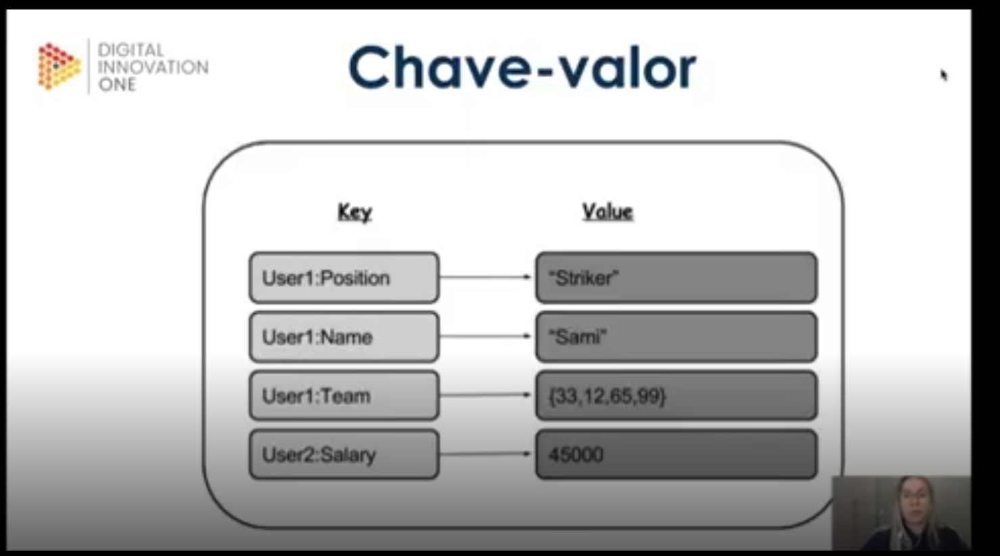

# 3 .Introducao ao MongoDB e Banco de dados NoSQL
## Sumário 
- [Introdução ao NoSQL](#1-introdução-ao-nosql)
  - [Apresentação do curso](#11-apresentação-do-curso)
  - [Apresentação](#12-apresentação)
- [Conhecendo tipos do BDNSQL](#2-conhecendo-os-tipos-de-banco-de-dodos-nosql)
  - [Tipos de Nosql](#21-tipos-de-banco-nosql)
  - [Grafos](#22-grafos)
  - [Colunar](#23-coluna-família-de-colunas)
  - [Chave Valor](#24-chave-valor)
  - [Documento](#25-documento)
- [Introdução e Instalação MongoDB](#3-introdução-e-instalação-ao-mongodb)
  - [Introdução MongoDB](#31-introdução-ao-mongodb)
  - [Instalação MOngoDB](#32-instalação)
  - [MongoDB Cloud](#33-mongodb-cloud)
- [Schema Design e B.P](#4-schema-design-e-boas-práticas)
  - [Schema Design](#41-schema-design)
  - [Boas Práticas](#42-boas-práticas)
  - [Json x Bson](#43-json-vs-bson)
- [Conceito na prática](#5-alguns-conceitos-na-prática)
  - [Operações de manipulação](#51-operações-de-manipulação-de-dados)
  - [Performance e índices](#52-performance-e-índices)
  - [Agregações](#52-performance-e-índices)
---
## 1. Introdução ao NOSQL
### 1.1 Apresentação do Curso
__Objetivo do curso__  
Introdução ao mundo do NoSQL, apresentar os tipos de bancos NoSQL assim como realizar pequenas operações em alguns deles com enfase no MongoDB no qual iremos desde sua instalação, opções de uso na nuvem e operações de manipulação de dados.

### 1.2 Apresentação 
#### 1.2.1  Objetivos do curso 
- Entender os fatores que levaram a criação dos bancos NoSQL. 
- Conhecer as principais diferenças gerais entre os BD SQL e NoSQL.
- Conhecer as características e vantagens do uso do BD NoSQL.

<table style="text-align: center; width: 100%;"> 
<tr>
    <td style="text-align: center;">
    
    </td>
</tr>
</table>

| | | |
| -- | -- | -- |
| N**ot**  | | **NO** |
| O**nly**| X |
| SQL | | **SQL** |

Diferenças entre BD Relacionais e BD NoSQL  
__Escalabilidade:__  Banco de dados **relacional** Vertical 
- Aumento da capacidade para um único recurso 
- Processador, memoria e disco rígido.
---
__Escalabilidade:__  Banco de dados **relacional** Horizontal 
- Replicas de dados __APENAS PARA LEITURA__    
--- 
__Escalabilidade__ Banco de dadoS **NoSQL** Horizontal 
- Particionando os dados (sharding) entre os nós é o mais conhecido.    

Sendo listado abaixo o maior beneficio da escalabilidade horizontal, presente nos Banco de dados Não relacionais.
1. Maior desempenho na aplicação. (Aperfeiçoando de acordo com a demanda, tendo uma escalabilidade "infinita")

Outra diferença de um BDR(Banco de dados relacional), para um Nosql,se da nos ditos Schemas de um BDR, nesse modelo de banco de dados temos um processo mais engessado, de todo processo conforme imagem abaixo.   

<table style="text-align: center; width: 100%;"> 
<tr>
    <td style="text-align: center;">
    
    </td>
</tr>
</table>

Já esse processo de Schema não se tem esse processo, podendo ter uma ausência quase que completa desse tipo de  regas de Schemas, ou seja não precisa definir no ato de criação do banco quais serão os tipos de dados a serem aceitos/inseridos naquelas tabelas. 

Outra diferença que aqui pode ser citada, e o caso de performance , em um BDR depende-se inteiramente da performance do tipo de disco que aquele banco está "alocado", em um Nosql ele dependerá mais do tamanho do cluster e da latência de rede.
No que se refere as diferenças de transações, segue a lista de comparativos 

| |Transações | |
| -- | -- | -- |
| BD Relacional | | BD NoSQL |
| **A**tomicidade | | **Ba**sically Available |
| **C**onsistência | | **S**oft-State |
| **I**solamento | | **E**ventually Consistent |
| **D**urabilidade | |  |

Das características e vantagens, são elas:
- Flexibilidade
- Escalabilidade
- Alta performance.

---
## 2. Conhecendo os tipos de banco de dodos NoSQL
### 2.1 Tipos de banco Nosql
<table style="text-align: center; width: 100%;"> 
<tr>
    <td style="text-align: center;">
    
    </td>
</tr>
<tr>
    <td style="text-align: center;">
    
    </td>
</tr>
</table>

### 2.2 Grafos

<table style="text-align: center; width: 100%;"> 
<tr>
    <td style="text-align: center;">
    
    </td>
</tr>
</table>

Grafos basicamente são estruturas matemáticas, que são compostas de nós e seus vértices, ao se abstrair isso para o mundo do banco de dados temos os nós que serão como os nossos dados, e os vértices serão os relacionamentos. Nesse modelo é muito comum para detecção de fraudes, mecanismos de recomendações, redes sociais, sistemas de arquivos, jogos etc... ao se consultas no ranking de banco de dados olhando para os banco do tipo de grafos temos o `Neo4j` como top 1 dos mais utilizados. 
Para a prática desse tipo de banco de dados iremos criar uma estrutura de registros que compões os dados de uma rede social utilizando um `sandbox do Neo4J`. É valido ressaltar que o `Neo4J` é um dos poucos banco de dados NoSQL que aplica as propriedades `ACID`,para além de também ter um bom desempenho no quesito de concorrência de transação, e outro ponto que é valido ressaltar, e que sua linguagem é conhecida como Cypher. 
Para tal processo foi utilizado um [sandbox do Neo4j](https://sandbox.neo4j.com/)   
Dentro do banco de dados foi criado uma label conforme comando abaixo. 
```cypher
CREATE(:Client {name: "Bob Esponja", age: 28, hobbies:['Caçar agua-viva','Comer hamburgueres']})
```
Após a criação desse label/nó podemos utilizar o comando de `match`que seria uma especie de select para o Neo4j, conforme abaixo:
```cypher
match (bob_espoja) return bob_espoja
```
O comando abaixo, demonstrar algumas características do Neo4j, sendo um banco de dados NoSQL, o Neo4j aplica também o conceito de Schema-free, ou seja não é necessário realizar o insert de todos os dados para algum nó mesmo que esse aplique-se a um label. Outro ponto , que podemos ver é que é possível também já aplicar o relacionamento entre nós com utilização de labels, e isso poderá ser feito diretamente no ato da criação de um nó, no comando abaixo, criamos um nó para cliente, e mais um para adicionar um relacionamento entre cliente e bloqueado que no caso esta sendo apontado tal relacionamento com `-[]->`, após o fechamento do `()` do primeiro nó
```cypher
CREATE (:Client{name:"Lula Molusco", age:30, hobbies:['Tocar clarinete']}) -[:Bloqueado]->(:Client{name:'Patrick Estela', hobbies:['Caçar agua-viva']})
```
Ao realizar o `MATCH`, podemos visualizar de forma gráfica os relacionamentos e nós existentes no banco  

<table style="text-align: center; width: 100%;"> 
<tr>
    <td style="text-align: center;">
    
    </td>
</tr>
</table>

Já para criar um relacionamento entre nós já existentes podemos realizar o seguinte comando, seguindo a estrutura MATCH (*A variável na qual é desejado a atribuição do Match*), similarmente a um processo de atribuição de variável. 
```cypher
MATCH (bob:Client{name:"Bob Esponja"}), (patrick:Client{name:'Patrick Estela'}) CREATE (bob)-[:Amigo]->(patrick)
```
O comando acima listado, obedece a seguinte estrutura. No bloco do `Match` estamos criando duas *"variáveis"* bob e patrick  e realizando a busca com o MATCH, no label de cliente nós que tenham em sua propriedade `name` os nomes, Bob Esponja e Patrick Estrela, após a busca e atribuição de variáveis com esse bloco, estamos criando um relacionamento entre elas com o bloco `CREATE` , onde estamos dizendo que bob é amigo de patrick, a relação de direcionamento é definida através do sentido da *"seta"* `< >` onde nesse caso exemplificado estou aponto de bob para patrick `->`.  
Agora para exclusão de um relacionamentos podemos utilizar a seguinte sintaxe:
```cypher
MATCH (patrick:Client{name:'Lula Molusco'})-[relacionamento:Bloqueado]->() DELETE relacionamento
```
Assim como foi realizado para criar um novo relacionamento a partir de um já existente, foi realizado também para a deleção de um relacionamento a utilização de um `Match`, porém o restante do comando diverge, após a busca e atribuição vemos que temos a abertura de um processo de relacionamento, seguido de uma variável e qual é a label utilizada,  e posteriormente qual será esse relacionamento apagado, onde informamos através de no nó anonimo `()`, que serão apagados todos os relacionamentos que tenham essa label, em seguida o comando recebe o comando DELETE e o que quero deletar que no caso é que existe para variável nomeada de relacionamento.  
Já para exclusão de um nó podemos, utilizar a mesma estrutura do comando para apagar o relacionamento, porém se a adição das condições de relacionamento conforme exemplo abaixo:
```cypher
MATCH (lula:Client{name:"Lula Molusco"}) DELETE lula
```
Já para atualizar um dado, propriedades para um nó existente, seguimos a ideia de atualização com base no retorno de um `MATCH`, porém a diferenciação do delete ou create o comando para atualizar algo em um nó é SET, após esse comando utilizamos a variável encontrada, e dizemos o que dentro da estrutura por exemplo do label o que vamos atualizar. 
```cypher
MATCH (patrick:Client {name:'Patrick Estela'}) SET patrick.age = 23;
```
Ainda na linha de atualização também podemos atualizar um label, para tal ao invés de atribuir a variável uma nova propriedade dentro de uma  label já existente , inserimos a sintaxe `SET variavel:Nome da nova label`.

---
### 2.3 Coluna-Família de colunas

<table style="text-align: center; width: 100%;"> 
<tr>
    <td style="text-align: center;">
    
    </td>
</tr>
</table>

Os banco de dados colunares tem uma forma de armazenamento diferente, ao contrário dos banco de dados relacionais tradicionais, que armazenam seus dados em uma única tabela, no bancos de dado NoSQL baseados em colunas, o seu armazenamento é realizado conforme o próprio nome sugere, em suas colunas, com suas informações diferentes entre elas.   
Já no banco de dados colunares um ponto que se é valido ressaltar a diferença trata-se da **hierarquia**, a sua distribuição e armazenamento e feito dentro do que é chamado de `keyspace`, dentro desse keyspace teremos uma família de colunas, sendo essa dita família de colunas similar ao que são as tabelas em banco de dados relacionais. ou seja dentro de cada keyspace teremos as informações agregadas em colunas, porém a coluna em si diferentemente do banco de dados relacional, não é constituída apenas do valor, essa coluna é constituída de 3 informações:
1. Chave da coluna, 
2. O valor da coluna. 
3. E o timestamp  
Outro ponto que é valido se ressaltar, e que em um banco de dados do tipo coluna, somente será armazenado em memoria algo que tenha informação.   

<table style="text-align: center; width: 100%;"> 
<tr>
    <td style="text-align: center;">
    
    </td>
</tr>
</table> 

Durante o estudo utilizaremos o banco de dados `Cassandra`, e é valido ressaltar que sua utilização e recomenda em cenários que temos um volume de leitura maior do que o de escrita, e seu uso tido como adequado e quando se tem a necessidade de realizar as consultas através da chave-primária.
#### 2.3.1 Diferenças terminológicas 
- __Keyspace:__ Agrupamento de famílias de colunas => Databases.
- __Column Family/Table:__ Agrupamento de colunas => table.
- __Row key:__ Chave que representa uma linha de coluna => Primary Key.
- __Column:__ Representa um valor contendo: Name, Value e Timestamp.  
- __Registro de transações:__  Compras, resultados de testes, filmes assistidos e localização mais recente do filme. Rastreando praticamente qualquer coisa, incluindo status do pedido de pacotes etc..
Outro ponto a ser considerado durante a utilização do banco de dados `Cassandra`, e que ele é um banco com ausência total de transações, e isso deve ser levado em consideração para sua escolha.   
Para se criar um `keyspace` utilizamos o seguinte comando. 
```cql
CREATE KEYSPACE NAME_KEYSPACE WITH replication = {'class': 'SimpleStrategy', 'replication_factory' : 1};
```
Conforme demonstrado no comando acima, diferentemente da criação de um `DATABASE` em um banco de dados SQL, no cassandra precisamos além das palavras reservadas, CREATE KEYSPACE, também temos que passar como instrução alguns argumentos de replicação daquele keyspace, através do trecho `WITH replication`, onde após tal comando passamos alguns valores com notação Json, no exemplo supracitado, passamos qual a classe que esse keyspace pertence, e posteriormente o fator de replicação. 
Para utilizar esse keyspace criado assim como em um banco SQL, utilizamos o comando:  
```cql
USE NAME_KEYSPACE
```
Para se criar um família de colunas, utilizamos a seguinte sintaxe:
```cql
CREATE COLUMNFAMILY NAME_COLUMN (name TEXT PRIMARY KEY, age int)
```
Assim como em `SQL` também definimos o Schema utilizado para essa column family ou seja, quais serão os valores e seus tipos. 
Já para realizar um consulta dentro do Cassandra, a sintaxe de uma consulta básica é a mesma. 
```cql
SELECT * FROM NAME_COLUMN;
```
O mesmo é valido para a inserção de dados nessa coluna, conforme demonstrado em comando abaixo:
```cql
INSERT INTO NAME_COLUMN (name, age) values ('Bob Esponja', 38);
```
Porém no `CQL` também temos a possibilidade de inserção de dados através de um arquivo `JSON`, para tal a sintaxe do comando é a seguinte:
```cql
INSERT INTO NAME_COLUMN JSON '{"name":"Patrick"}';

```
A diferenciação desse tipo de inserção da-se primariamente pela palavra reservada `JSON`, onde é sinalizado ao Cassandra que os valores a serem inseridos nesse banco serão obtidos através de dados em formato JSON.  
Um ponto a ser notado dentro do CASSANDRA é que por mais que no ato de um select quando não há valores dentro de uma coluna, como no caso a inserção do da linha do comando acima, não foi passado a coluna o valor de age, porém ao se realizar o comando: 
```cql
SELECT age, WRITETIME(age) from NAME_COLUMN;
```
Na segunda linha que seria correspondente ao "atributo" age de patrick será retornado null em ambos, pois no banco de dados Cassandra ele não aloca espaço em disco para registros nulos. 
Para se realizar filtros ou condições de busca no cassandra o comando utilizado assim como no SQL, também é o comando `WHERE`.
Outro ponto de diferenciação de comandos do cassandra é que conseguimos durante o *SELECT* que a consulta em questão sejá retornada em forma de `JSON`, para que isso seja executado utilizamos o seguinte comanado:  
```cql
SELECT JSON  * FROM NAME_COLUMN;
```
Para atualizar registros dentro do cassandra o comando é igual a de um SQL, seguindo a seguinte sintaxe:
```cql
update name_column
set age = 2 
where name = 'Patrick';
```
O mesmo se aplica para alteração de uma CollumFamily, a sintexe para adição de uma nova coluna se da na seguinte forma:
```cql
ALTER COLUMNFAMILY NAME_COLUM  add hobby text;
```
Após algumas inserções podemos ver também uma grande difenreça entre os tipos de bancos de dados, pois caso atualizarmos 2 columas mesmo que no mesmo comando, cada atualização tera um writetime diferente, o que reforça a ideia que as colunas das coleções são independentes, 
exemplo 
```cql
update cliente
set hobby = 'caçar agua vida' where name = 'Patrick';

select age, WRITETIME(age), hobby,  WRITETIME(hobby) where neme = 'Patrick';
```
Iremos visulizar valores diferentes no WRITETIME de age e hobby. 
Para deletar um registro no Cassandra o comando se igua-la o do sql também seguindo a sintaxe:
```cql
DELETE from cliente WHERE name = 'Bob Esponja';
```
---
### 2.4 Chave-valor

<table style="text-align: center; width: 100%;"> 
<tr>
    <td style="text-align: center;">
    
    </td>
</tr>
</table> 

O modelo  de banco de dados chave-valor, assim como o nome pressupõe é constituido por duas partes, sendo a chave (tendo que ser única para cada registro), e o valor correspondente a aquela linha.  
O banco de dados desse modelo, pode armazenar um conjunto de dados, seja ele simples ou complexo, identificados por um identificador exclusivo. 
Tem como um de seus beneficios o **bom desempenho em aplicações em nuvem** , porém **sua capacidade de busca é inferior ou menor** em relação aos demais. No que tange ao seu uso ele é bastante utilizado nos cenários de : armazenamento de cache, sessão de usuários, carrinhos de compra.  

<table style="text-align: center; width: 100%;"> 
<tr>
    <td style="text-align: center;">
    
    </td>
</tr>
</table> 

Para a prática e exemplos dessa aula utilizaremos o banco de dados Redis,entre suas utilizações podemos destacar o uso em : cache, messageria e fila.
- Alto desempenho. 
- Estrutura de dados na memória. 
- Versatilidade de uso. 
- Replicação e persistência. 

Para tal utilizaremos um site para exemplificação sendo ele : [try-redis](https://try.redis.io/).  
Um ponto a ser salientado e que dentro de um banco de dados Key Value, não possuimos o conceito de Schema, como o mesmo é feito de maneira de chave valor como próprio nome diz, este conceito não se aplica.  
**OBS:** Durante a aula não foram repassados comandos de criação de banco de dados somente comandos de manipulação de dados.
Para criar uma propriedade ou inserção de valor, usamos o comando descrito abaixo, porém antes da exemplificação propriamente dito, é sempre valido ressaltar que como definição desse tipo de banco de dados, 
__Não é possível realizar a busca de informações através de seu valor, por tal motivo e suma importância que se tenha o conhecimento da chave__  
```redis 
SET user1: name "Bob Esponja"
```
Já para realizar a consulta de informações dentro do banco, utilizamos a seguinte sintaxe:
```redis
GET user1:name
```
Conforme já descrito anteriormente, não é possível relaizar buscas pelo valor, essa busca é feita através de sua chave.  
Pelo fato do `Redis` não possuir uma definição de Schema mesmo em tempo de criação, ele aceita qualquer valor, o que permite por exmeplo inserção de valores em formato de JSON por exemplo:
```redis
SET user '{"name": "Patrick", "age": 31}'
```
Quando recuperado tal informação teremos uma saída em formato de JSON
```redis
GET user
```
```bash
"{\"name\": \"Patrick\", \"age\": 31}"
```
Dentro do redis, temos ainda no ambito de criação dos registros, um recurso de tempo de expiração de uma chave o que faz com que ele seja muito utilizado para armazenamento de cash e sessões de usarios, tendo duas propriedades para tal sendo elas:
- ex  = Que irá determinar em quantos segundos, aquele registro irá expirar. 
- px  = Que irpa determinar em quantos milesegundos, aquele registro irá expirar.  
```redis
SET user2: name "Lula Molusco" EX 10
```
Outro comando que pode ser citado é o `EXISTS`, com esse comando seguido da chave desejada, o redis irá retornar 0 caso aquela chave não exista mais e 1 caso contrário.  
O redis também permite a manipulação de algumas collections como por exemplo `lista` `set` e `hashset`, tendo para cada um desses tipos uma função expecifica para a a sua manipualção.   
Para se manipular uma lista temos os comandos:
- >Inserção  
```redis
LPUSH user1: hobbyes "Caçar agua-viva"
```
E impotante que após a inserção através desse método, é retornado na plataforma o valor do indice do dado que foi inserido. 
- >Consulta
```redis
LINDEX user1:hobbyes 0
```
O comando acima é utilizado para retornar um determinado valor de uma lista, já para obtenção de todos os valores da lista utilizamos o comando:  
```redis
LRANGE user1:hobbyes 01
```
Nesse comando utilizamos qual a chave está sendo procurada, e posteriomente qual o range de index a ser retornado.   

Para obter o tipo de valor utilizamos o comando `TYPE`.
Outro comando que pode ser listado aqui é o comando `TTL`, que irá retornar o tempo de expiração de uma determinada chave, para que esse retorno seja em milesegundos utilizamos `PTTL`. 
Em contra ponto ao comando de expiração, temos também o comando `PERSIST` com esse comando o tempo de expiração de um dado e removido.   
Para realizar a deleção de uma chave, para além do tempo de expiração temos o comando:
```redis 
DEL user2:name
```
Esse comando irá remover chave. 
 
----
### 2.5 Documento
<table style="text-align: center; width: 100%;"> 
<tr>
    <td style="text-align: center;">
    
    </td>
</tr>
</table>  

Dados e documentos autocontidos e auto descritivos, ou seja todas as informações necessárias para sua existencia estaram dentro do documento.   Permite a redundância e inconsistência, então podemos ter documentos com diferentes estruturas dentro da mesma collection.  
Livre de esquemas podendo utilizar, JSON, XML entre outros. 

<table style="text-align: center; width: 100%;"> 
<tr>
    <td style="text-align: center;">
    
    </td>
</tr>
</table>  

Como restante da aula será com foco no mongo db não serão exemplificados comandos e etc.. nesse capitulo 

--- 
## 3. Introdução e Instalação ao MongoDB
### 3.1 Introdução ao MongoDB
O MongoDB é um banco de dados de código aberto, ele tem também é conhecido pela alta performance em usa utilização além de ser Schema-free, o que seguinifica que não a necessidade de definição dos tipos de dados ou algo do tipo no ato de inserção das collections, outro conceito relacionado ao MongoDB, trata-se do fato que dentro de uma collection ter a possibilidade de documentos de estruturas diferentes, o mongo utiliza arquivos um tipo de arquivo Bson que é uma "mistura de arquivos Json com binários" para o armazenamento de chave-valor, outro ponto importante sobre o MongoDB e o seu suporte a indices, em sua concepção o MongoDB foi projetado naturalmente para escalonamento horizontal conhecido como `Auto-Sharding`, também possui uma ferramenta extremamente poderosa conhecida como `Map-Reduce`, que trabalha na parte consutla e agregação, além de suportar `GridFS` que nada mais é o suporte ao armazenamento de arquivos. 
#### 3.1.1 Analogias do MongoDB x SQL

| | | 
|-- | --|
|Mongo | SQL |
|Document | Tupla/Registro | 
|Collection | Tabela | 
|Embedding/Linking | Join |

- O documento e a menor unidade de informação dentro do banco e identifica o seu registro tal qual um tupla, mesmo que o MongoDB possua suporte a ter referências a outros documentos dentro do banco, porém essa prática não deve ser implementada sem critérios muitos definidos, pois fere a ideia de um documento ser auto contido e auto descritivo, pois ao se utilizar um tipo de banco de dados como o MongoDB é preciso ter em mente que o dados não devem depender de outros dados, o que pode acarretar em redundância de dados em certo momento, porém isso não implica diretamente em um ônus de utilização. 
- Uma colllection é analogo a uma tabela em SQL, ou seja dentro de uma collection será armazenado N documentos, porém a diferença entre essas duas entidades,se da no fato que uma collection e Schema-free, pois as definições dos tipos de dados serão aplicadas diretamente aos documentos. 
- Embedding/Linking esse comando associa-se muito a um  `JOIN` em SQL, para que possamos fazer referências a outros documentos existentes no mongo porém o idel para tal utilização seria que tais documentos estejam conditos de forma Embedding, o que significa que dentro de um documento conterá a subestrutura do mesmo. 

#### 3.1.2 Quando Utilizar ou não o MongoDB
__Quando utilizar o MongoDB?__  

1. Quando se possui um grande volume de dados. 
2. Quando houver dados que não estejam necessariamente estruturados. 

__Quando NÃO utilizar o MongoDB?__   

1. Quando houver a necessidade de relacionamentos entre os dados/tabelas etc...
2. Quando algum item das propriedades **ACID** e transações de informações forem importantes.  

> Curiosidade: Diversas entidades de pagamento não homologam sistemas cujos dados financeiros dos clientes não estejam em banco de dados relacionais tradicionais. 

----
### 3.2 Instalação
Para esta aula, vamos utilizar o conceito de contêineres com Docker, gerenciando nosso ambiente com um único arquivo `docker-compose.yml`. Este documento conterá comentários explicativos, mas detalharemos as principais diretivas a seguir.

Após a instalação do Docker Desktop, vamos criar e configurar o arquivo `docker-compose.yml` com a seguinte estrutura:

```yaml
# Define a versão da sintaxe do Docker Compose
version: '3.8'

# Agrupa a definição de todos os nossos contêineres (serviços)
services:
  # O nome do nosso serviço de banco de dados
  db:
    # A imagem que será usada para criar o contêiner.
    # É uma boa prática fixar a versão para garantir a estabilidade.
    image: mongo:6.0
    
    # Nome personalizado para o contêiner, facilitando sua identificação.
    container_name: meu-mongo-db
    
    # Política de reinício: o contêiner será reiniciado automaticamente, a menos que seja parado manualmente.
    restart: unless-stopped
    
    # Mapeia a porta 27017 da máquina hospedeira para a porta 27017 do contêiner.
    ports:
      - "27017:27017"
      
    # Define as variáveis de ambiente dentro do contêiner.
    # Elas são usadas pelo script de inicialização do Mongo para criar o usuário root.
    environment:
      MONGO_INITDB_ROOT_USERNAME: ${MONGO_USER}
      MONGO_INITDB_ROOT_PASSWORD: ${MONGO_PASSWORD}
      
    # Mapeia o volume nomeado 'mongo-data' para a pasta /data/db dentro do contêiner.
    # Isso garante que os dados do banco sobrevivam mesmo que o contêiner seja removido.
    volumes:
      - mongo-data:/data/db

# Seção para declarar os volumes nomeados gerenciados pelo Docker.
volumes:
  mongo-data:
    driver: local

```
 - image: mongo:6.0  
    Como o MongoDB é amplamente utilizado, não é necessário criar uma imagem do zero (com um Dockerfile). Em vez disso, usamos uma imagem oficial e pronta do [Docker Hub](https://hub.docker.com). Adotamos a prática de fixar a versão `(ex: mongo:6.0)` para garantir que o ambiente seja estável e previsível, evitando que atualizações automáticas quebrem a aplicação no futuro.

- environment  
    Esta diretiva define variáveis de ambiente dentro do contêiner. A imagem oficial do mongo utiliza as variáveis `MONGO_INITDB_ROOT_USERNAME e MONGO_INITDB_ROOT_PASSWORD` em seu script de inicialização para configurar o primeiro usuário administrador do banco de dados. Para maior segurança, os valores dessas variáveis são lidos de um arquivo .env, que não deve ser enviado para o repositório Git.
- ports  
    A porta 27017 é a porta padrão de comunicação do MongoDB. A configuração `"27017:27017"` "expõe" a porta do contêiner, permitindo que aplicações rodando na sua máquina hospedeira se conectem ao banco de dados que está dentro do contêiner.
- volumes  
    Esta é a diretiva mais importante para a persistência de dados. Contêineres são, por design, efêmeros. Se um contêiner for removido (ex: com docker-compose down), todos os dados dentro dele são perdidos. A diretiva volumes mapeia uma pasta de dentro do contêiner (no caso, /data/db, onde o Mongo salva seus arquivos) para uma área de armazenamento gerenciada pelo Docker na sua máquina hospedeira. Dessa forma, os dados existem de forma independente do ciclo de vida do contêiner, garantindo que não sejam perdidos.

Após a configuração do `docker-compose` o mesmo será inicializado com o comando:
```bash
# O argumento -d e informado para que o terminal não seja "travado"
docker-compose up -d
```
Após subir o container, é possível visualizar se o serviço foi iniciado com o comando, que irá listar todos container ativos
```bash
docker container ps 
```
Após tal processo poderiamos realizar a conexão deste container criado com o mongo instalado localmente através de linha de comando com a seguinte sintaxe:
```bash
mongo --host localhost:27017 -p password -u user
```
onde localhost seria "trocado" pelo iplocal da máquina onde contem o mongodb, assim como password e user seriam trocados pelo usuários e senha defininos o enviroment criado no docker ou na senha diretamente definida. 
Porém caso não tenha a instalação previa do mongodb, pode ser utilizado, de uma conexão remota [client](https://robomongo.org) para tal, esse client irá diponibilizar o download do software `robomongo`, que após sua instalação, será inicializado o software propriamente dito, para que o mesmo funcione corretamente, será necessário informações como:
Nome da conexão deseja: 
tipo de conexão: standalone para o caso de estudo. 
server port obitdos no ato da criação do container, porém poderá ser localhost e a porta definida no [yaml](db/Docker/docker-compose.yaml).
Authentication 
- Authenticatio mode : basica
- User name: O nome de usuário definido no arquivo ou nas variaveis de ambiente. 
- Pssword: A senha definida no arquivo ou nas variaveis de ambiente. 
- Authentication DB: pode ser utilizado admin.
Com esses passo seguidos, poderemos utilizar o mongo db.

---
### 3.3 MongoDB Cloud
Outra alternativa para utilização do mongodb é através do [mongodb cloud](https://cloud.mongodb.com/v2/688ad8be6158e91c31a6d6cc#/overview), após o cadastro no site do mongodb, e inicialização do modo cloud, dentro da plataforma e possível criar um serviço de mongodb e utiliza-lo porém as demais aulas serão feitas via docker d Robo3t ou extensão no vscode.

---
## 4. Schema Design e Boas práticas
### 4.1 Schema Design 
### 4.2 Boas práticas
### 4.3 Json vs Bson
---
## 5. Alguns conceitos na prática
### 5.1 Operações de manipulação de dados
### 5.2 Performance e índices 
### 5.3 Agregações


### Links Uteis
- [EXEMPL](https://github.com/digitalinnovationone/trilha-python-dio)
- [Neo4j Sandbox](https://sandbox.neo4j.com/)
- [Cassandra-try](https://katacoda.com/datastax/courses/cassandra-try-ir-out/try-cql)
- [Redis](https://try.redis.io/)
- [Docker compose docs](https://docs.docker.com/compose/)
- [Docker Hub](https://hub.docker.com)
- [Robo 3T client](https://robomongo.org)
- [Mongodb Cloud](https://cloud.mongodb.com/v2/688ad8be6158e91c31a6d6cc#/overview)
---
As respostas da aula 3 estão [aqui](IMGS)

tabela exemplo 
| | |
| -- | -- |
| nome | valor |

<div style="border-left: 4px solid red; background-color:rgb(22, 23, 24); padding: 10px;">
  <strong style="color: red;">Exemplo de alerta</strong>
  <p> Somente um exemplo.</p>
</div>

exemplo código 
```
print("Hello World!")
```
---
<table style="text-align: center; width: 100%;"> 
<caption><b>Skils do projeto </b></caption>
<tr>
    <td style="text-align: center;">
    
    </td>
    <td style="text-align: center;">
    
    </td>
    <td style="text-align: center;">
    
    </td>
<tr> 
</table>

---
Titulo: 3 .Introducao ao MongoDB e Banco de dados NoSQL 

Autor: Thierry Lucas Chaves

Data criacao: 21/07/2025

Data modificacao: 30/07/2025

Versao: 1.0  

---