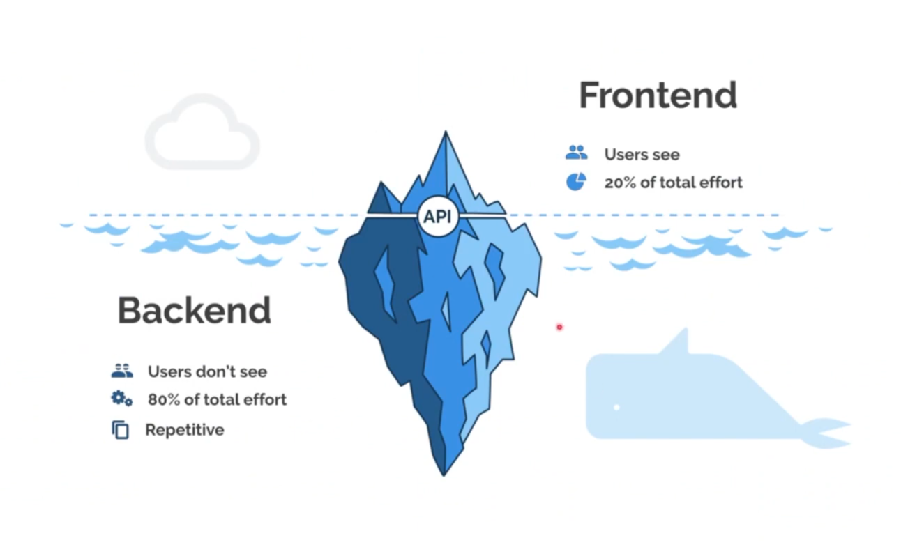
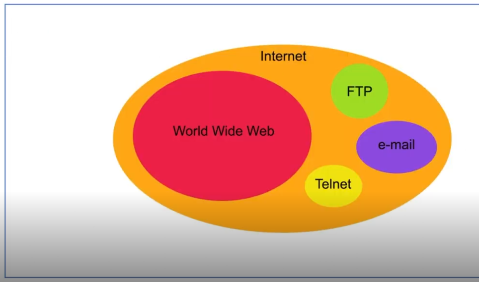
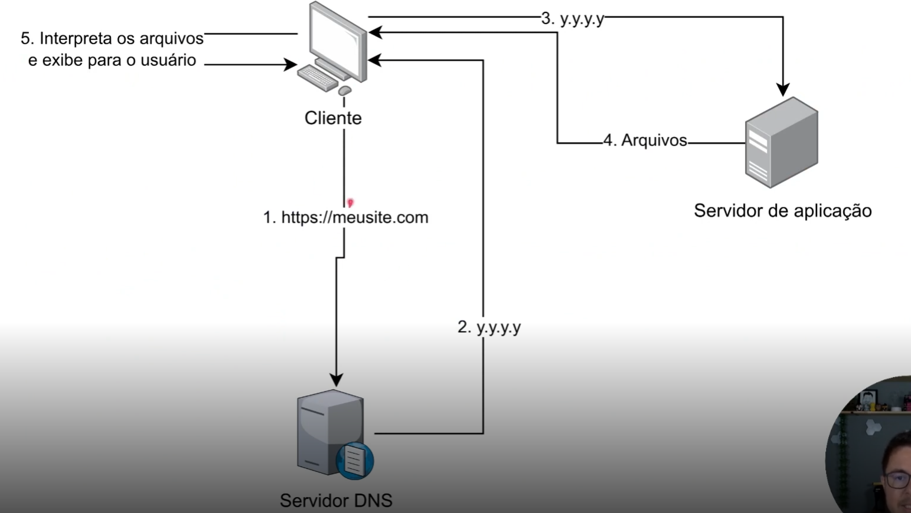
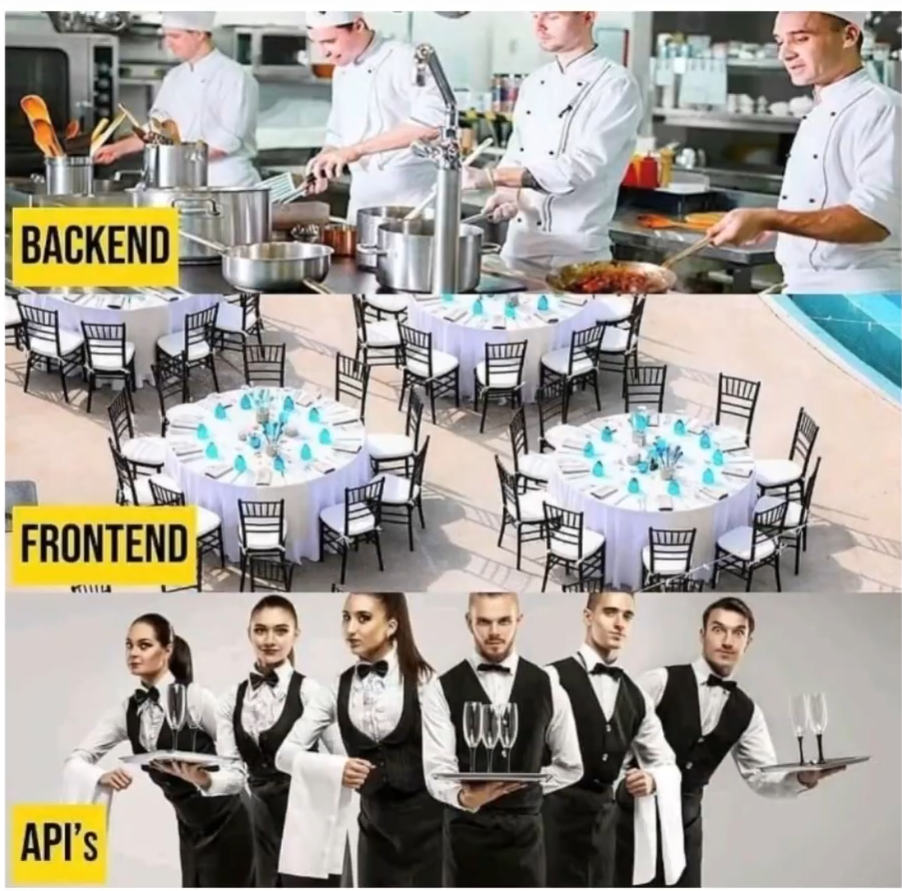
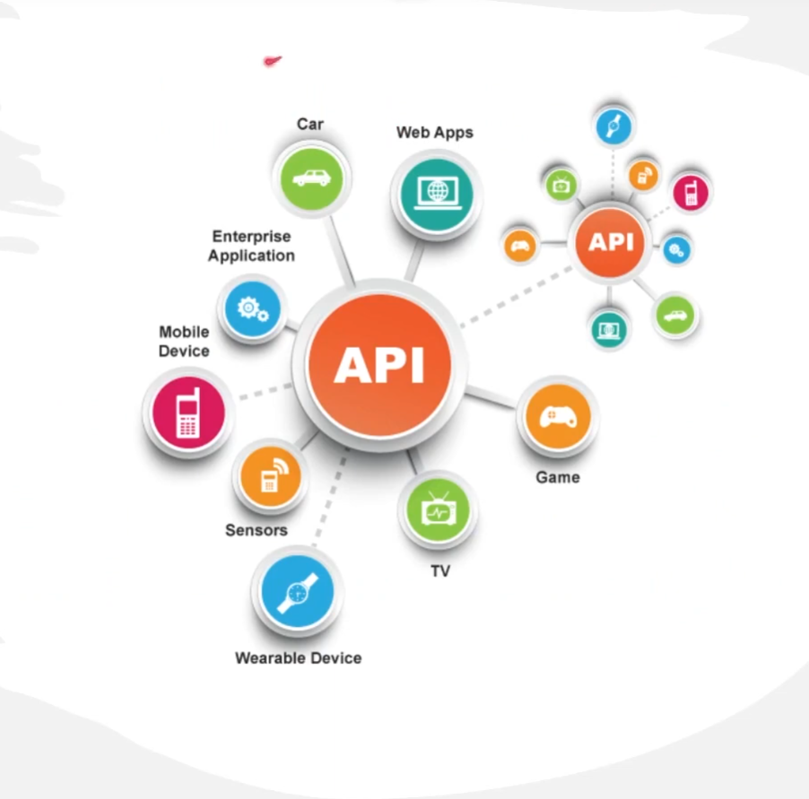

# 1 . Introdução a aplicações Rest
## Sumário 
- [Introdução](#1-introdução-ao-desenvolvimento-web)
  - [Objetivo Geral](#11-objetivo-geral)
  - [O que é desenvolvimento Web](#12--o-que-é-desenvolvimento-web)
  - [Componentes principais](#13--componentes-principais)
- [Como funciona a Web](#2-como-a-web-funciona)
  - [Internet x Web](#21-internet-vs-web)
  - [Protocolo HTTP](#22-protocolo-http)
  - [Funcionamento de website](#23-funcionamento-de-um-website)
  - [Tecnologias envolvidas](#24-tecnologias-envolvidas)
- [Front & Back End](#3-tecnologias-front-end-e-back-end)
  - [O que é front-end](#31-front-end-a-interface-do-usuário)
    - [Tecnologias chave](#311-tecnologias-chave)
  - [O que é back-end](#32-back-end-a-lógica-por-trás-dos-bastidores)
    - [Linguagens e tecnologias](#321-linguagens-e-tecnologias)
  - [Dev Full Stack](#33-desenvolvimento-full-stack)
- [Conceito APIs](#4-apis-e-conceitos-fundamentais)
  -[O que é uma API](#41-o-que-é-uma-api-)
  -[Contexto de API na Web](#42-apis-no-contexto-da-web)
  -[A importância das APIS](#43-importância-das-apis)
  -[Exemplo de API](#44-exemplos-práticos)
- [Tipos de APIs](#5-tipos-de-apis---restfull-soap-e-graphql)
  - [API RESTfull](#51-api-restfull)
    - [Características de API RESTful](#511-características-de-apis-restful)
  - [API SOAP](#52-api-soap)
    - [Características de API SOAP](#521-características-de-apis-soap)
  - [API GraphQL](#53-api-graphql)
    - [Características de API GraphQL](#531-características-de-apis-graphql)
  - [Escolhendo o tipo de API](#54-escolhendo-o-tipo-certo-de-api)
- [Verbos](#6-verbos-http---getpostpatchput-e-delete)
  - [Verbos HTTP](#61-verbos-http-em-apis-restful)
  - [Convenções](#62-convenções-restful)
---
## 1. Introdução ao Desenvolvimento Web
### 1.1 Objetivo Geral 
Introduzir os conceitos fundamentais do desenvolvimento web, compreendendo a estrutura básica da web, a arquitetura cliente-servidor e as principais tecnologias front-end e back-end. 

### 1.2  O que é desenvolvimento Web?
Desenvolvimento web refere-se ao processo de criação de websites e aplicações para internet ou uma intranet. Abrange uma variedade de tarefas, incluindo web design, programação web, gestão de banco de dados e engenharia de servidores. 

### 1.3  Componentes principais 
- __Frontend:__ A parte do website que os usuários interagem diretamente. Envolve a criação de interfaces de usuário e experiências, usando tecnologias como HTML, CSS e JavaScript. 
- __Backend:__ O 'bastidor' de um website, onde ocorrem o processamento de dados, gerenciamento de banco de dados e controle de servidor. Envolve linguagens como Python Java Go etc..

<table style="text-align: center; width: 100%;"> 
<tr>
    <td style="text-align: left;">
    
    </td>
</tr>
</table>

---
## 2. Como a Web Funciona 
### 2.1 Internet vs Web 
A internet é uma rede global de computadores interconectados. A Web, ou World Wide Web, é um sistema de informação construído sobre a internet que utiliza o protocolo HTTP para transmitir dados. 

<table style="text-align: center; width: 100%;"> 
<tr>
    <td style="text-align: left;">
    
    </td>
</tr>
</table>

### 2.2 Protocolo HTTP
HTTP (Hypertext Transfer Protocol) é o protocolo fundamental usado na Web para a transferência de dados. Quando um usuário acessa um site, o navegador envia uma solicitação HTTP para o servidor do site, que responde com os dados do site.

### 2.3 Funcionamento de um WebSite

1. __Solicitação do usuário:__  Tudo começa com o usuário inserindo um URL no navegador ou clicando em um link. 
2. __Resolução de DNS:__  O URL é traduzido em um endereço IP através de um sistema chamado DNS (Domain Name System).
3. __Conexão com o servidor:__ O navegador utiliza o endereço IP para estabelecer uma conexão com o servidor que hospeda o site.
4. __Resposta do servidor:__  O servidor processa a solicitação HTTP e envia de volta os arquivos geralmente em HTML, CSS e JavaScript
5. __Renderização no navegador:__ O navegador interpreta esses arquivos e exibe os site ao usuário. 

<table style="text-align: center; width: 100%;"> 
<tr>
    <td style="text-align: left;">
    
    </td>
</tr>
</table>

### 2.4 Tecnologias envolvidas
Além de HTML, CSS E JavaScript, tecnologias como SSL/TLS para segurança, APIs para interatividade e bancos de dados para armazenamento de dados também desempenham um papel vital no funcionamento da Web.

--- 
## 3. Tecnologias front-end e back-end
### 3.1 Front-end: A interface do usuário
Front-end refere-se à parte do desenvolvimento web que lida com a interface do usuário. O objetivo é apresentar informações de forma interativa e acessível para o usuário final.

#### 3.1.1 Tecnologias Chave
- __HTML(Hypertext Markup Language):__ Estrutura o conteúdo da web.
- __CSS (Cascading Style Sheets):__ Estiliza e apresenta o conteúdo HTML.
- __JavaScritp:__ Torna as páginas web interativas e dinâmicas.

### 3.2 Back-end: A lógica por trás dos bastidores
Back-end é a parte do site que o usuário não vê. Inclui servidor, aplicação e banco de dados. É responsável por gerenciar e processar dados, garantindo que tudo no front-end funcione corretamente. 
#### 3.2.1 Linguagens e tecnologias
- __Linguages:__ Python, Ruby, PHP, Java, JavaScript, entre outras.
- __Banco de dados:__ PostgreSQL, MySQL, MongoDB, Oracle, etc..
- __Frameworks:__ Django (Python), Express (JavaScripts), Spring Boot (Javas);

### 3.3 Desenvolvimento Full Stack
Desenvolvedores Full Stack são profissionais que têm habilidades tanto em front-end quanto em back-end, sendo capazes de trabalhar em ambas as áreas do desenvolvimento web.

--- 
## 4. APIs e conceitos fundamentais
### 4.1 O que é uma API ?
API ou Interface de programação de aplicações, é um conjunto de regras e definições que permite que diferentes aplicações de software ou componentes se comuniquem entre si. Funciona como um intermediário, permitindo que pedidos sejam feitos e respostas sejam recebidas entre diferentes sistemas de software.

<table style="text-align: center; width: 100%;"> 
<tr>
    <td style="text-align: left;">
    
    </td>
</tr>
</table>

### 4.2 APIs no contexto da Web
Na web, as APIs são usadas para permitir a  interação entre diferentes serviços e aplicações, como enviar dados de um usuário de um aplicativo para um servidor ou solicitar dados de um serviço externo (por exemplo, redes sociais, mapas, previsão do tempo).

### 4.3 Importância das APIs
As APIs são cruciais para a construção de aplicações modernas e escaláveis. Elas permitem a flexibilidade para integrar e expandir funcionalidades sem reinventar a roda.

<table style="text-align: center; width: 100%;"> 
<tr>
    <td style="text-align: left;">
    
    </td>
</tr>
</table>

### 4.4 Exemplos práticos
- APIs de pagamento: Facilita transações de comércio eletrônico através de diferentes plataformas de pagamentos.

[API Vindi](https://vindi.github.io/api-docs/dist/#/)

--- 
## 5. Tipos de APIs - RESTfull, SOAP e GraphQL
### 5.1 API RESTfull
RESTful refere-se a APIs que seguem os princípios do REST (Representational State Transfer). São baseadas em padrões HTTP e utilizadas para interações web.
#### 5.1.1 Características de APIs RESTful 
- Uso dos métodos HTTP (GET, POST, PUT, DELETE) para operações CRUD
- Curva de aprendizado menor.
- Fácil de entender e implementar.

### 5.2 API SOAP
SOAP (Simple Object Access Protocol) é um protocolo que define um padrão para troca de mensagens baseadas em XML.

#### 5.2.1 Características de APIs SOAP
- Protocolo baseado em XML para troca de informações. 
- Independente de linguagem e plataforma de transporte.
- Suporte para operações complexas e segurança avançadas.

### 5.3 API GraphQL
Uma linguagem de consulta para sua API, e um servidor capaz de executar essa consultas, retornando apenas os dados especificados.
#### 5.3.1 Características de APIs GraphQL
- Permite que os clientes especifiquem exatamente quais dados querem. 
- Eficiente na redução de solicitações e no tamanho dos dados transferidos.
- Flexível e fortemente tipada, facilitando a evolução das APIs.

### 5.4 Escolhendo o tipo certo de API
A escolha depende das necessidades especificas do projeto, dos recursos disponíveis e da expertise da equipe. 
RESTful é popular pela simplicidade, SOAP é preferido para segurança e transações complexas, enquanto GraphQL é ideal para aplicações que requerem dados dinâmicos personalizados. 

--- 
## 6. Verbos HTTP - GET,POST,PATCH,PUT e DELETE
### 6.1 Verbos HTTP em APIs RESTful
Em APIs RESTful, os verbos HTTP têm papéis específicos que se alinham com as operações CRUD.  
Esta abordagem padronizada permite que as APIs sejam intuitivas e previsíveis, facilitando a interação entre diferentes sistemas e aplicações
### 6.2 Convenções RESTful
**GET** para leitura, **POST** para criação, **PUT/PATCH** para atualização e **DELETE** para remoção.
Essas convenções são fundamentais para o design de uma API RESTful bem projetada.

--- 
### Links Uteis
- [API Vindi](https://vindi.github.io/api-docs/dist/#/)
- [XML w3schools](https://w3schools.com/xml/xml_soap.asp)
- [Graphql](https://studio.apollographql.com/public/SpaceX-pxxbxen/variant/current/explorer)
- [Boas práticas APIs RESTfuls](https://web.dio.me/articles/7-boas-praticas-para-apis-restful-profissionais)
---
As respostas da aula 1 estão [aqui](imgs/prova/)

---
<table style="text-align: center; width: 100%;"> 
<caption><b>Skils do projeto </b></caption>
<tr>
    <td style="text-align: center;">
    
    </td>S
    <td style="text-align: center;">
    
    </td>
<tr> 
</table>

---
Titulo: 1 . Introdução a aplicações Rest 

Autor: Thierry Lucas chaves

Data criacao: 21/08/2025

Data modificacao: 21/08/2025

Versao: 1.0  

---