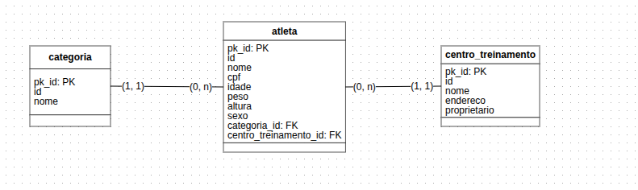

# 2 . Desenvolvendo sua Primeira API com FastAPI, Python e Docker
## Sumário 
- [Sobre a expert](#1-sobre-a-expert)
- [Apresentação do projeto](#2-apresentação-do-projeto-e-instruções)
- [Criação Atleta](#3-criação-de-schemas-e-models---entidade-atleta)
- [Criação Categoria e CT](#4-criação-de-schemas-e-models---entidades-categoria-e-centro-de-treinamento)
- [Docker e Alembic](#5-utilização-do-docker-compose-e-configuração-do-alembic)
- [Configurando o banco e Settings](#6-inserindo-configurações-do-banco-de-dados-e-adicionando-sttings)
- [Rota Categoria](#7-criação-das-rotas-de-categoria)
- [Rota Centro Treinamento](#8-criação-das-rotas-de-centro-de-treinamento)
- [Rota Atleta PT.1](#9-criação-das-rotas-de-atleta---pt1)
  - [Rota Atleta PT.2](#91-criação-das-rotas-de-atleta---pt2)
- [Consumindo API com Postman](#10-consumindo-api-com-postman)
- [Entendendo do Desafio](#11--entendendo-o-desafio)

---
## 1. Sobre a Expert
Esse módulo será focado em flashAPI, e as documentações necessárias estão presentes no GITHUB

---
## 2. Apresentação do projeto e instruções
---
## FastAPI
Framework FastAPI, alta performance, fácil de aprender, fácil de codar, pronto para produção. FastAPI é um moderno e rápido(alta performance) framework web para construção de PAIs com Python 3.6 ou superior, baseado nos type hints padrões do Python. 

### Async 
Código assíncrono apenas significa que a linguagem tem um jeito de dizer para o computador/programa que em um certo ponto, ele terá que esperar por algo para finalizar em outro lugar.    

### Projeto 
#### WorkoutAPI
Está é uma api de competição de crossfit chamada WorkoutAPI. é uma API pequena, devido a ser um projeto mais hands-on e simplificado nós desenvolveremos uma API de poucas tabelas, mas com o necessário para você aprender como utilizar o FastAPI.

#### Modelagem de entidade e relacionamento - MER

<table style="text-align: center; width: 100%;"> 
<tr>
    <td style="text-align: center;">
    
    </td>
</tr>
</table>

#### Stack da API
A API foi desenvolvida utilizando o fatapi(async), junto das seguintes libs: `alembic, SQLAlchemy, pydantic.` Para salvar os dados está sendo utilizado o `postegres`, por meio do `docker`


#### Execução da API
Para executar o projeto, utilizei a `pyenv`, com a versão 3.11.4 do python para o embiente virtual.
Caso opte por usar pyenv, após instalar, execute:

```bash
pyenv virtualenv 3.11.4 workoutapi
pyenv activate workoutapi
pip install -r requirements.txt
```
Para subir o banco de dados, caso não tenho o `docker` e o `docker-compose` instalado, faça a instalação logo em seguida execute:
```bash
make run-dcoker
```
para criar uma migration nova, execute:
```bash
make create-migrations d="nome_da_migration"
```
para criar o banco de dados, execute:
```bash
make run-migrations
```

#### API
Para subir a API, execute:
```bash
make run
```
acesse: https://127.0.0.1:8000/docs

#### Desafio final 

1. Adicionar query parameters nos endpoints 
  - Atleta 
    - nome 
    - cpf
2. Customizar response de retorno de endpoints
  - get all
    - Atleta
      - Nome
      - Centro de treinamento 
      - Categoria
3. Manipular exceção de integridade dos dados em cada módulo/tabela
  - sqlalchemy.exc.IntegrityError e devolver a seguinte mensagem: "Já existe um atleta cadastrado com o cpf: x"
  - status_code: 30 
4. Adicionar paginação utilizando a lib: fatapi-pagination
  -limit e offset

--- 
<div style="border-left: 4px solid red; background-color:rgb(22, 23, 24); padding: 10px;">
  <strong style="color: red;">Observação</strong>
  <p>O código a ser desenvolvido será feito em outro repositório.</br>
  <b>Neste documento conterá apenas informações sobre os código a informações 
  relevantes sobre o projeto.</b>
  </p>
</div>

## 3. Criação de schemas e models - Entidade Atleta
<div style="border-left: 4px solid red; background-color:rgb(22, 23, 24); padding: 10px;">
  <strong style="color: red;">Observação</strong>
   <p> Durante a execução desse curso não foi utilizado o `.venv` </br>
   padrão muitas vezes utilizado e sim o pyenv 
  </p>
</div>

Após a configuração do pyenv foi realizado a criação de um sub-diretório dentro do repositório, chamado de `workout_api`, com 2 arquivos iniciais.   
Sendo eles `__init__.py` e o arquivo `main`, dentro do main, foi realizado import da `FASTAPI`.  
Dentro do arquivo main, foi realizado as configurações básicas do servidor a ser criado com as libs `Fastapi &  uvicorn`. para tal processo foi realizado a seguinte sintaxe:  
```py
from fastapi import FastAPI

app = FastAPI(title="WorkoutAPI")

if __name__ == "main":
    import uvicorn

    uvicorn.run("main:app", host="0.0.0.0", port=8000, log_level="info", reload=True)

```
Sobre os comandos listados acima vale ressaltar alguns pontos, send o primeiro realizamos a instância de um objeto nomeado app com as propriedades da FastAPI e passado como parâmetro dentro dos possíveis apenas o title, para que esse tenha um titulo *"personalizado"*, após o processo acima, foi inicializado o main do arquivo importando a biblioteca `uvicorn` e realizado a instância do método run da biblioteca, para tal foi realizado a seguinte passagem de argumentos: 
1. Nome do main caracterizado pelo trecho `"main:app"`, ou seja realizando a atribuição do objeto app para main.
2. informações de ip e porta caracterizados pelos trechos: `host e port`, como o servidor será executado localmente não foi realizado a passagem de um ip e porta específico 
3. O parâmetro `log_level`, foi atribuído também nessa passagem esse parâmetro é responsável por realizar o log das operações no terminal. 
4. O parâmetro `realod`, foi habilitado também para que caso seja realizado alguma alteração dentro do código não seja necessário parar o servidor que está sendo criado, ou seja esse parâmetro irá reiniciar automaticamente o servidor criado e *"entender"*, quais alterações foram aplicadas.

Após a confecção do arquivo main, do projeto foi realizado a inicialização do mesmo através da sintaxe:
```bash
# Como o arquivo main, não se encontra na pasta raiz do projeto
# foi passado o nome da pasta antes do arquivo main:app
uvicorn workout_api.main:app --reload
```
Outro ponto passado também para facilitar o processo de "subir a API", foi realizado a criação de um `Makefile`, esse arquivo em grosso modo serve como um facilitador de alguns comandos, ou seja adicionamos alguns comandos dentro desse arquivo e a partir de então não será necessário realizar a digitação do comando por completo. Dentro desse arquivo foi adicionado o seguinte comando:
```makefile
run:
	@uvicorn workout_api.main:app --reload
```
Com esse arquivo diretamente na raiz do projeto, para que a API seja subida novamente basta digitar agora no terminal o seguinte comando abaixo:
```bash
make run
```
ou seja substituímos o comando `uvicorn workout_api.main:app --reload` por apenas `make run`

---
Notações:
Após a configuração inicial do projeto citada acima foi realizado a criação da primeira entidade do projeto que no caso foi o atleta. 

Para tal foi criado um diretório nomeado de `atleta` , dentro do sub-diretório workout_api, realizado a criação do arquivo `__init__.py`, e criado 2 outros arquivos sendo o models e schemas, onde dentro do arquivo de schemas, foi realizado a configuração da entidade atleta, para tal utilizamos a biblioteca `pydantic` com os módulos `BaseModel, Field, PositiveFloat`, bem como utilizamos também a `typing` 
a classe atleta foi por notação da `pydantic`, essa classe deverá entender/herdar a classe `BaseModel`. 
dentro da classe em questão foi realizado a criação dos atributos da classe conforme o mer com os atributos `nome,cpf,idade,peso,altura e sexo`, foi utilizado o `Annotated`, para atribuir algumas informações dessa entidade como o tipo do campo, e informações dentro do campo caracterizado pelo método `Field` passando os parâmetros de descrição exemplo e em alguns casos tamanho Máximo, outro ponto que é valido ressaltar e que a biblioteca da pydantic oferece para definição de campos do tipo **float** um método chamado de PositiveFloat, no qual define que esse atributo não aceitará valores negativos.

Após a criação do Schema do atleta criamos um model, e nesse ponto conforme passado, em aula devemos criar um classe *Abstrata* de modelo, para tal criamos um classe chamada de BaseModels que herda propriedades de `DeclarativeBase`, essa classe abstrata criada, tem como objetivo criar um UUID, e que esse atributo não seja exposto para o usuário que irá consumir a API.  
De posse dessa classe em contrib, criamos o nosso model para atleta, onde sim criaremos uma tabela de atleta, nea utilizamos as importações de 
```py 
sqlalchemy, datetime, BaseModel
# Sendo BaseModel nossa classe abstrata para o UUID
```
para esse arquivo importamos os módulos `Mapped, mapped_column` (que também foram utilizados na base model). 
Dentro da classe criamos a tabela atletas que seguiu o MER e o schema, porém para criação a sintaxe foi a seguinte 
```py
# Imporações da bibliotecas e módulos
class AtletaModel(BaseModel):
  __tablename__ = 'atletas' # aqui foi definido o nome da tabela
    pk_id: Mapped[int] = mapped_column(Integer, primary_key=True)
    nome: Mapped[str] = mapped_column(String(50), nullable=False)
```
No exemplo acima seguimos a notação da sqlalchemy, e um ponto interessante a ser notado é que como a classe de models de atleta está herdando a propriedade da BaseModel criada em contrib, não foi criado diretamente na tabela o UUID, pois esse não será informado ao usuário que irá consumir essa API. a notação para essa criação segue o padrão de 
1. Nome do campo (pk_id)
2. Mapped[int] define qual será o tipo do campo a ser criado. 
3. mapped_cloumn(Integer, primary_key=True) Nesse trecho definimos qual é o tipo condizente no banco para a coluna e suas propriedades. 
No exemplo do nome não foi passado o comando primary_key e sim nullable que iforma que essa tabela não será nula. 


--- 
## 4. Criação de schemas e models - Entidades Categoria e Centro de treinamento

--- 
## 5. Utilização do Docker Compose e configuração do Alembic

--- 
## 6. Inserindo configurações do banco de dados e adicionando sttings
---
## 7. Criação das rotas de Categoria
---
## 8. Criação das rotas de Centro de treinamento
---
## 9. Criação das rotas de Atleta - PT1
---
## 9.1. Criação das rotas de Atleta - PT2
---
## 10. Consumindo API com Postman
---
## 11.  Entendendo o Desafio
---
### Links Uteis
- [FastAPI](https://fastapi.tiangolo.com)
- [Pydantic](https://docs.pytantic.dev/latest/)
- [SQLAlchemy](https://docs.sqlalchemy.org/en/20)
- [Alembic](https://alembic.sqlalchemy.org/en/latest/)
---
As respostas da aula 2 estão [aqui](IMGS)

tabela exemplo 
| | |
| -- | -- |
| nome | valor |

<div style="border-left: 4px solid red; background-color:rgb(22, 23, 24); padding: 10px;">
  <strong style="color: red;">Exemplo de alerta</strong>
  <p> Somente um exemplo.</p>
</div>

exemplo código 
```
print("Hello World!")
```
---
<table style="text-align: center; width: 100%;"> 
<caption><b>Skils do projeto </b></caption>
<tr>
    <td style="text-align: center;">
    
    </td>
    <td style="text-align: center;">
    
    </td>
    <td style="text-align: center;">
    
    </td>
<tr> 
</table>

---
Titulo: 2 . Desenvolvendo sua Primeira API com FastAPI, Python e Docker 

Autor: Thierry Lucas chaves

Data criacao: 21/08/2025

Data modificacao: 21/08/2025

Versao: 1.0  

---